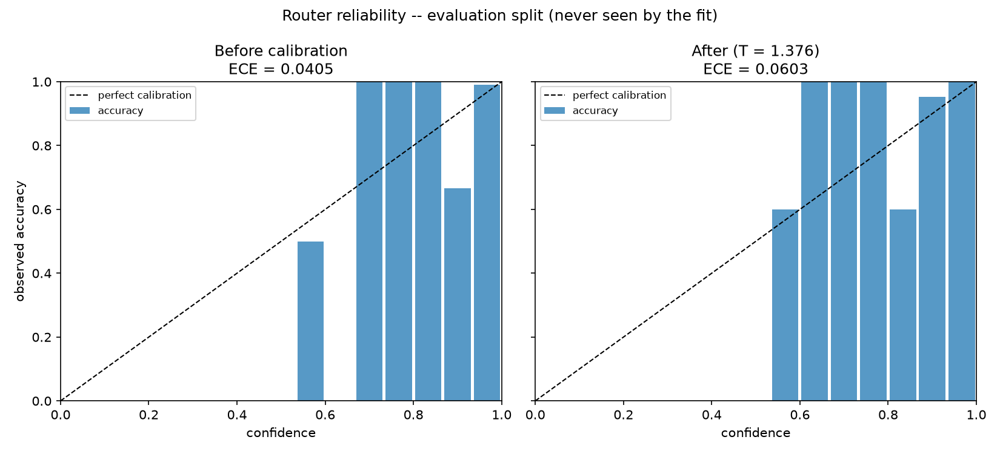
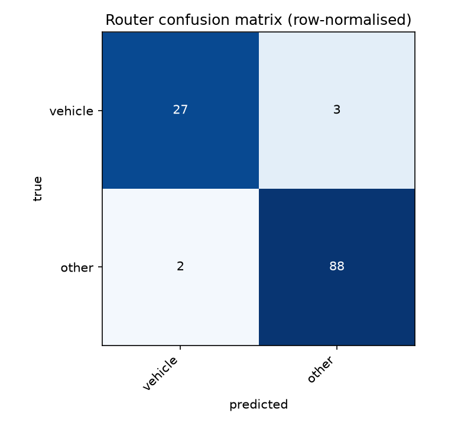

# BioVision

**A damage-analysis API that tells you what it does not know.**

BioVision takes a photograph of damage, decides which *domain* the photo belongs to
(vehicle, building, phone screen, …), runs a domain-specific expert model if
one exists — and, when one does not exist, says so explicitly instead of guessing.

> ## Status
>
> **The system runs end to end.** Upload a photograph and it is validated,
> decoded, oriented, hashed, redacted, resized, gated, routed, and either
> measured by a specialist or answered honestly — with real models on CPU.
>
> **Every measurement table below is now filled**, and four of them report that
> something did not work:
>
> | Measured | Outcome |
> |---|---|
> | Router, vehicle vs everything else | 95.8% top-1, 94.0% macro (§7.1) |
> | Gate | 3.3% false reject, 7.0% false accept (§7.2) |
> | Overall severity | 64.5%, and 51% on the band that matters (§7.8) |
> | Face redaction | 3.2% miss rate (§5.1) |
> | Calibration | **Refused** — made ECE worse (§6) |
> | 960 px retraining | **Rejected** — `scratch` moved 0.001 (§7.3) |
> | Tiled inference | **Rejected** — −0.229 precision (§7.7) |
> | Wide-shot framing | **Fails** — the failure is published, not fixed (§7.7) |
> | Detection floor 0.25 vs 0.20 | **No optimum** — a stated trade, +0.025 recall for −0.070 precision (§7.3) |
>
> **An empty cell means the measurement has not been run.** It never means zero,
> and it is never filled by estimation — only by a script in `backend/scripts/`.
> That rule is the whole point of the project applied to its own documentation —
> which is why the rejections above are in this table rather than absent from it.
>
> **What is still not demonstrated:** anything requiring the VPS. Latency and cost
> figures come from a development machine and say so.

---

## What is proven, and what is not

The distinction this project is about, applied to itself.

| Claim | Evidence |
|---|---|
| Findings cannot exist without a model behind them | Enforced by a pydantic validator **and** a Postgres CHECK constraint; the response fails to construct. `tests/unit/test_schema_invariants.py` |
| Adding a domain needs no code change | A domain absent from `src/` becomes a real softmax column from YAML alone, tested against the **real** router. `tests/unit/test_domain_extensibility.py` |
| A weak routing guess never runs a specialist | `tests/contract/test_analyze_contract.py` |
| Anonymous traffic cannot spend the VLM budget | Call-counter assertion. `tests/contract/test_vlm_fallback.py` |
| The same image reaches the paid API once | Call-counter assertion, including a re-encoded copy |
| An exhausted budget degrades rather than fails | 503 on the fallback path, 200 on the specialist path |
| The stored image carries no EXIF | `tests/unit/test_ingest.py` |
| Redaction destroys detail rather than smoothing it | Every pixel in a mosaic block is identical |
| **Face redaction misses 3.2% of faces** | Measured over 95 annotated faces, WIDER FACE subset — §5.1 states the filter |
| One user cannot read another's history *via this API* | `tests/contract/test_history_isolation.py` |
| **Postgres itself refuses a cross-user read** | 7 tests against a real database, no API in the path — `uv run python -m scripts.rls_check`. Finding this out took one command and found a real defect: see below. |
| The database refuses a finding with no model behind it | The same CHECK constraint, exercised by a direct write that bypasses the API |
| The container starts with no network and no egress | Built and run; 9 s cold start either way |
| A broken weights mount is reported, not hidden | `/health` returns 503 and Docker marks the container `unhealthy` |
| No server-side secret reaches the browser | Verified against the built bundle; CI fails if one appears |
| **The vehicle specialist measures rather than guesses** | Trained on VehiDE, evaluated on its held-out validation set. Per-class table in §7.3, worst rows included. |
| **The router separates a vehicle from everything else 95.8% of the time** | 120 held-out images; 94.0% macro-averaged, and the `vehicle` row is the weak one at 90%. Confusion matrix and every error in §7.1 |
| **Overall severity is 65.5% accurate, 51% on `severe`** | 319 images, confusion matrix and the under-calling bias in §7.8. Reported uncalibrated, and the UI says so. |
| **An intact car is called intact rather than "lightly damaged"** | The band had no fourth option, so 82% of undamaged cars came back as `minor`. Adding one took `severe` recall from 46/91 to 46/91 — unchanged — and no genuinely severe car has ever landed in it. §7.8 |
| **The specialist fires on clean cars, and the rate is published** | 44% of 71 intact vehicles produced a finding at the shipped floor, 60% a region — never measured before, because every earlier sweep used damaged cars only. §7.8, §7.10 |
| **Asking for more confidence where a second signal disagrees** | False alarms 44% → 20% for 0.009 of instance recall, against 0.111 for the flat-threshold alternative. The stricter floor that scored better was deliberately NOT taken. §7.10 |
| **The gate wrongly accepts 7% of out-of-scope uploads** | 115 images across six categories. Selfies are the worst row at 15% — §7.2 |
| **The damaged area is a fraction of the *car*, not of the frame** | Retains 0.92 of its value under a 100% pad where the frame ratio retains 0.23. Available on 86% of severe-damage photographs, **null** on the rest rather than silently falling back — §7.9 |
| **The masks cover 0.854 of the annotated damage** | 90–120 held-out images, pixel coverage against spill, with the floor sweep that has a knee at 0.10 and a second view in the mirror — §7.9 |
| **The ceiling on this checkpoint is view-dependent recall** | Flipping the photograph finds damage the original view missed: coverage 0.794 → 0.854 from the same weights. Loosening mask boundaries moved `dent` by +0.028; the mirror moved it by +0.057 — §7.9 |
| **A severity band arrives with the frequency it was right** | Read down the §7.8 columns: 85% for `severe`, and for `moderate` the modal truth is `severe` at 51%. A count, not a model output. `tests/unit/test_band_reliability.py` |
| **The claim side never returns a verdict** | A contract test walks the whole serialised assessment payload and fails on any field named like a prediction. `tests/contract/test_claims_routes.py` |
| **A payout branch is a number or a range, never both** | Enforced by a pydantic validator; an open figure must also name what would close it. `tests/unit/test_claim_scenario.py` |
| **Every rung of both premium tables is swept** | All 9 trafik steps and all 6 kasko kademe × 3 claim counts, against the Ek-2 figures and the published clause **typed out a second time** — so the shipped YAML is compared to an independent transcription rather than to itself. `tests/unit/test_claim_scenario.py` |
| **The mirrored TSB values match the source workbook** | Rebuilt from the live August 2026 file and compared row for row: 79,380 rows, zero differences. The build now refuses to overwrite a good mirror with values outside a plausible band. `tests/unit/test_tsb_parsing.py` |
| **The irreversible consequence of the 60% line is never behind a click** | Crossing it puts a registration record on the vehicle that ends the değer kaybı claim outright. Money is recoverable and that is not, so `irreversible` consequences render in front of the reader and the procedural ones go behind a disclosure. `tests/contract/test_claims_routes.py` |
| **Ağır hasar and tam hasar are not modelled as parallel rules** | m.5(1) is a bare 60% threshold; m.4(1) is cumulative — cost above value **and** an expert finding. Flattening them would write off repairable cars at the boundary. |
| End-to-end p95 is far under the queue threshold | 372 ms with the specialist running, +75 ms once the vehicle is located — but on a **development machine**, not the VPS |

**Measured and rejected** — the outcome this project treats as a result rather than
a gap:

| Claim | What the measurement said |
|---|---|
| ~~The router's confidences are calibrated~~ | Temperature scaling made ECE **worse** on held-out data (0.0405 → 0.0603). The fit is not loaded, every response still says `calibrated: false`, and §6 explains why the router was under-confident rather than over-confident. |
| ~~`scratch` is limited by resolution~~ | Retrained at 960 px: `scratch` moved by **−0.001**, overall by +0.001, for double the inference cost. The 960 px model is not shipped. What the failure rules out is in §7.3. |
| ~~The dent mask is drawn too tightly~~ | Loosening the mask cut-off from probability 0.5 to 0.1 moved `dent` coverage by **+0.028**; lowering the *detection* floor moved it by **+0.160**. So the failure is whole panels never detected, not boundaries — a different fix entirely. §7.9 |
| ~~Higher inference resolution recovers extent~~ | Coverage **fell** at both 960 px (0.680) and 1280 px (0.647) against 0.788 at 640. §7.9 |
| ~~Clipping damage to the vehicle mask reduces spill for free~~ | Against a matched control on the same 90 images: spill 0.268 gated vs **0.265 ungated**, for **−0.072 coverage**. The predictions were already on the car; the clip removed real damage instead. §7.9 |
| A crack model trained on licence-clean Turkish data ships | Trained on METU/Özgenel (CC BY 4.0), split by parent photograph: **0.9986 accuracy, 1.0000 recall** on held-out clusters, 200 ms on the production CPU. Pointed at 15 ordinary living rooms it flagged **15/15 at every threshold up to 0.9999** — but through the live pipeline, where the gate and router stand in front of it, the same rooms give **1/15** and 60 cracked walls give **59/60**. Connected, with `specialist_small_evaluation` on every response. §7.11 |
| ~~Tiling raises konut damage-type accuracy to 69.4%~~ | Retracted. The direction is real -- tiles beat the whole frame in a paired comparison -- but the evaluation set was contaminated: the `water` class held two paintings and a kimono, the `crack` class held Lake Baikal ice and freeze-dried ice cream. Built, measured, wired into the API, reverted before release. §7.11 |
| ~~Warning a user about a blurry photograph helps them~~ | Blur, clipped pixels and contrast were measured on 399 VehiDE photographs against what the specialist found in them. **No signal shows a relationship**: the blurriest quartile finds the MOST (1.68 findings/image against 1.59 for the sharpest), the most clipped quartile also finds the most, and contrast bounces. A capture warning would have made users retake photographs for no measured benefit, and a capture gate fails silently — the analysis it prevents never happens. `scripts/eval_capture_quality.py` |
| ~~A trained crack model beats zero-shot on konut photos~~ | The only licence-clean ground-level konut checkpoint in nine hubs (`OpenSistemas/YOLOv8-crack-seg`, AGPL-3.0, mAP50 0.639) sits **on the ROC diagonal** here: at its default it reports a crack in 64% of intact rooms. Matched at 24% false alarm it recalls **27%** against tiled CLIP's **80%**. Rejected. §7.11 |
| ~~A zero-shot prompt can name the konut damage type~~ | 51.2% over 160 images, and the failure is disqualifying: **59 of 115 genuinely damaged photographs were called undamaged**, including 34 of 60 cracks. `water` — the most common konut claim — was never identified once. `building` keeps `specialist_model: null`. §7.11 |
| ~~A repair cost can be estimated from the photograph~~ | Searched again, deliberately: no openly available dataset anywhere pairs damage photographs with a repair cost or a total-loss outcome, and every published method uses private insurer data. So the product answers the *payout* question without the cost — the total-loss branch is exact arithmetic over the vehicle's value, and the repair branch is returned as a bounded interval that names what would close it. §7.9, `claims/scenario.py` |

**Not proven yet**, and stated as such wherever it appears:

| Claim | What it needs |
|---|---|
| Router accuracy on photographs like a real user's | The evaluation set is three clean sources, and `other` is now 60 of its 120 images — §7.1 says where it is optimistic, and why 95.8% is not an improvement on 95.0% |
| VPS latency, real cost per request | A deployment |

---

## 1. Why this project exists

Most damage-assessment demos report a single accuracy number and stay silent about
where they break. That number is unusable for anyone who has to underwrite risk.

BioVision is built around the opposite claim:

* Every confidence score the API returns is either **calibrated** (and the response
  says `calibrated: true`) or **not calibrated** (and the response says
  `calibrated: false`). There is no third state.
* Domains without a trained expert model return `specialist_model: null`,
  an empty `findings` array, and an explicit `warning`. The system never fabricates
  structured findings from a general-purpose model.
* The evaluation section below reports **per-class** performance, not an average that
  hides the weak classes.

---

## 2. Architecture

Three layers, evaluated in order. Each layer can reject the request.


The diagram is drawn around the exits rather than the components, because the exits
are the argument. Four of the five are the system declining to answer, and each
declines for a different and stateable reason.

<details>
<summary>The same path as text</summary>

```
        upload
          │
          ▼
   ┌──────────────┐   not a damage/object photo
   │ L0  Gate     │ ────────────────────────────►  422 out_of_distribution
   │  CLIP 0-shot │
   └──────┬───────┘
          │ passes
          ▼
   ┌──────────────┐
   │ L1  Router   │  which domain? (candidate labels come from a config file)
   │  CLIP 0-shot │  raw softmax today; temperature scaling once a set exists
   └──────┬───────┘
          │
     ┌────┴─────────────────────────┐
     │ specialist exists?           │
     ▼ yes                          ▼ no
┌──────────────────┐      ┌─────────────────────────┐
│ L2  Specialist   │      │ Fallback: cloud VLM     │
│ VehiDE YOLO-seg  │      │  free-text description  │
│  → findings[]    │      │  → findings = []        │
│  calibrated:false│      │  calibrated:false       │
└──────────────────┘      │  warning: no_specialist │
                          └─────────────────────────┘
```

</details>

**The central architectural promise:** adding a new domain to the router is a
one-line change in `backend/src/biovision/domains/domains.yaml`. No code change,
no redeploy of model logic. A test enforces this.

### Layer summary

| Layer | Model | Runs on | Calibrated | Purpose |
|---|---|---|---|---|
| L0 Gate | CLIP zero-shot | CPU | — (a threshold, not a probability) | Reject selfies, screenshots, landscapes |
| L1 Router | CLIP zero-shot | CPU | **no** — scaling was fitted and refused, §6 | Assign a domain |
| L2 Specialist — vehicle | VehiDE fine-tuned YOLO-seg | CPU | **no** — severity is a rule, not a fitted model | 7-class damage segmentation |
| L2 Specialist — all other domains | *none* | — | no | Returns `null`, honestly |
| Fallback | Claude Haiku 4.5 | remote | no | Free-text description only, authenticated callers |

---

## 3. The honesty contract

This is the part of the project that matters most.

> The two examples below show the contract **once a specialist and a fitted
> temperature exist**. Today neither does, so a live response carries
> `specialist_model: null`, `calibrated: false` and
> `domain_confidence_calibrated: false` — the shape in the second example, for
> every domain including `vehicle`.

**Domain with a specialist:**

```json
{
  "request_id": "uuid",
  "domain": "vehicle",
  "domain_confidence": 0.93,
  "domain_confidence_calibrated": false,
  "specialist_model": "vehide-yolo-seg-v1",
  "calibrated": false,
  "findings": [
    {
      "type": "scratch",
      "score": 0.81,
      "bbox": [120, 340, 260, 410],
      "area_ratio": 0.04,
      "severity": "moderate",
      "severity_calibrated": false,
      "class_recall": 0.275,
      "class_reliable": false
    }
  ],
  "integrity": {
    "exif_datetime": "2026-03-14T10:22:00Z",
    "exif_gps_present": true,
    "device": "Apple iPhone 14",
    "duplicate_of": null
  },
  "privacy": {
    "faces_blurred": 0,
    "plates_blurred": 0,
    "face_detector": "yunet-2023mar",
    "plate_detector": null
  },
  "timing_ms": { "gate": 60, "router": 95, "specialist": 380, "total": 610 }
}
```

**Domain without a specialist:**

```json
{
  "request_id": "uuid",
  "domain": "building",
  "domain_confidence": 0.71,
  "domain_confidence_calibrated": false,
  "specialist_model": null,
  "calibrated": false,
  "findings": [],
  "vlm_description": "A horizontal crack is visible on the wall ...",
  "warning": "no_specialist_model_for_domain"
}
```

`findings` is **never** populated from the VLM. A free-text description is a
description, not a measurement, and the schema keeps those two things apart.

### Two flags, because they are two facts

| Field | Question it answers |
|---|---|
| `calibrated` | Is this **result** a calibrated measurement? True only when a calibrated specialist produced the findings. |
| `domain_confidence_calibrated` | Has `domain_confidence` itself been temperature-scaled? |

They are separate because a calibrated router can route to a domain that has no
specialist at all. Collapsing them into one flag would force a choice between calling
a trustworthy confidence untrustworthy, or calling a description a measurement.

Both are `false` today, and §6 says why: temperature scaling was fitted, measured,
and refused for making ECE worse.

### Two numbers per finding, because they answer different questions

| Field | Question it answers |
|---|---|
| `score` | How sure is the model about **this box**? |
| `class_recall` | How much does the model **miss** in this class, measured on held-out data? |

A high `score` on a `dent` still comes with `class_recall: 0.253` — the model finds
about a quarter of the dents that are there. Without both numbers, one finding on a
badly damaged car reads as light damage; with them it reads as a floor.

`class_reliable` is false below recall 0.40, which is where this project stops
calling a class usable. That threshold is a judgement call, published rather than
hidden, and the per-class figures behind it are §7.3.

### Enforced, not merely intended

These rules are pydantic model validators, not conventions in a route handler. A
response with findings and no specialist behind them **fails to construct** — it
cannot reach a client. The invariants are covered by
`tests/unit/test_schema_invariants.py`:

* findings must be empty when `specialist_model` is null;
* `calibrated` must be false when `specialist_model` is null;
* a response without a specialist must carry a `warning` explaining why;
* `vlm_description` must be null when a specialist produced the result — if a
  specialist ran, the paid fallback was never called;
* a non-zero blur count requires a named detector.

---

## 4. API

| Method | Path | Purpose |
|---|---|---|
| `POST` | `/v1/analyze` | Analyze one image |
| `GET` | `/health` | Liveness + per-model load state |
| `GET` | `/v1/domains` | Supported domains and whether each has a specialist |
| `GET` | `/v1/requests` | The authenticated user's own request history |
| `DELETE` | `/v1/requests/{id}` | Delete one of the caller's analyses |
| `DELETE` | `/v1/requests` | Delete everything the caller has stored |
| `POST` | `/v1/claims/assessment` | **The whole claim picture for one vehicle** |
| `GET` | `/v1/claims/regulation` | The rule sheet, gaps included |
| `GET` | `/v1/claims/write-off-lines` | Both thresholds in lira for one vehicle |
| `GET` | `/v1/claims/premium-impact` | What one payment does to a trafik step |
| `GET` | `/v1/claims/vehicle/*` | Model year → brand → trim → listed value (TSB) |

**Everything under `/v1/claims` runs no model.** It reads
`domains/regulation.yaml` and divides, which is why it is the only part of this
system whose output needs no caveat about accuracy: a rule either cites its
article or it is not served.

`/v1/claims/assessment` is the one a client actually calls. Every field of its
body is optional and each closes a different figure — a request with nothing in
it still returns the rule sheet and the list of questions, because a claimant an
hour after a crash has not found their policy yet. What it never returns is a
verdict, a write-off probability, or a repair cost; a contract test walks the
serialised payload and fails if a field appears under any of those names.

### Error codes

| Code | Meaning |
|---|---|
| `401` | Sign-in required, or the token is invalid |
| `404` | No such analysis for this caller |
| `413` | File exceeds the size limit (10 MB) |
| `415` | Unsupported format |
| `422` | Rejected by the gate — not a damage/object photograph |
| `429` | Rate limit exceeded |
| `503` | VLM budget exhausted — `service_degraded` |

A `503` means the fallback path is off. Requests for domains **with** a specialist
keep working; the system degrades, it does not fail.

Full generated schema: [`docs/openapi.json`](docs/openapi.json).

---

## 5. Image processing pipeline

Order is fixed and enforced in a single module (`pipeline/ingest.py`):

1. **Format check** — `jpg`, `png`, `webp`, `heic` (HEIC via `pillow-heif`; iPhone photos
   arrive as HEIC and rejecting them would exclude most real-world uploads).
2. **Size check** — max 10 MB.
3. **EXIF read** — capture time, GPS presence (boolean only), device — retained for the
   integrity block.
4. **EXIF-orientation rotation** — applied before any model sees the image.
5. **Perceptual hash (pHash)** — duplicate detection and VLM cache key.
6. **Face redaction** — applied before storage. Plates are not redacted; see 5.1.
7. **EXIF strip + resize** to 1280 px long edge — only this version is written to storage.
8. **Model inference.**

**The raw upload is never persisted.** Only the redacted, EXIF-stripped, resized
derivative reaches Supabase Storage — `PreparedImage` has nowhere to put the original
bytes, so this is structural rather than a habit.

Rejected inputs: animated GIF/WebP, images under 200 px, corrupt or truncated files.
Format is decided by magic bytes, never by the filename or Content-Type, and every
upload is decoded — a truncated file passes a header check and fails a decode.

Two orderings are load-bearing:

* **Orientation before everything.** Phones record rotation as metadata rather than
  rotating pixels. A model handed the raw buffer sees a sideways car, and the boxes
  it returns are in a coordinate frame the user never saw.
* **Hash before redaction.** The perceptual hash identifies the *submitted*
  photograph. Hashing afterwards would make the fingerprint depend on how many faces
  the detector happened to find, so the same image could hash differently on a second
  submission and slip past duplicate detection.

### 5.1 Redaction — what is actually redacted

| Class | Detector | Recall | Miss rate | False positives |
|---|---|---|---|---|
| Faces | YuNet (`yunet-2023mar`) | **96.8%** | **3.2%** | 5 |
| Plates | *none* | n/a | n/a | n/a |

Measured over 95 annotated faces in 50 photographs, at IoU 0.3 — a loose
threshold on purpose, because redaction pads its boxes and covering the face
matters far more than tracing it. Three faces in fifty photographs were missed.
The five false positives cost nothing: a mosaic over some bodywork.

**The sample is filtered, and the filter is part of the claim.** The images come
from WIDER FACE's validation set, restricted to **1–6 faces per image, each at
least 40 px** on its shorter side. WIDER FACE is a hard benchmark by design; it
contains stadium crowds with two hundred faces at twelve pixels each, and
including them would produce a much worse number describing a benchmark rather
than this system. What this system receives is a phone photograph of a damaged
car with a bystander in it, and that is the regime measured above.

Reproduce with `scripts/fetch_wider_faces.py` then `scripts/eval_redaction.py`;
the exclusions are printed and counted rather than quietly applied — 1,010
images excluded for face count, 465 for face size, 4 for having none.

**3.2% is not zero.** In fifty photographs, three faces were stored unblurred.
The privacy policy says faces are blurred; this table says how often that fails,
which is the difference between a promise and a measurement.

**Plates are not blurred.** OpenCV 5 removed `CascadeClassifier`, which takes the
bundled Haar plate cascade off the table; pinning OpenCV back to 4.x to regain it
would buy a detector trained on Russian plates whose accuracy on Turkish plates has
never been measured. Under this project's own rule — a privacy guarantee needs a
number behind it — an unmeasured detector may not ship as one. Plate redaction is
deferred to Phase 5, where Ultralytics arrives for the vehicle specialist and brings
a YOLO plate detector into reach under a licence already in use here.

Until then every response carries `plate_detector: null`. The schema distinguishes
the two states that matter:

* `"face_detector": "yunet-2023mar", "faces_blurred": 0` — we looked, found none.
* `"plate_detector": null` — **we did not look.**

A non-zero blur count without a named detector fails schema validation, so a
redaction claim cannot be made without something behind it.

Redaction is a mosaic, not a Gaussian blur. A blur is a convolution and is at least
partly invertible; downsampling to blocks and scaling back up genuinely discards the
information.

#### Measured miss rate

| Class | Detector | Annotated boxes | Recall | Miss rate | False positives |
|---|---|---|---|---|---|
| face | `yunet-2023mar` | | | | |
| plate | *not redacted* | | n/a | n/a | n/a |

Produced by `backend/scripts/eval_redaction.py`. **Empty because it has not been
run** — the annotated set does not exist yet. Recall is the metric that matters: a
missed face is a privacy failure, while a false positive only mosaics some bodywork.

---

## 6. Calibration

A softmax output is not a probability. A "93% confidence" claim only means something
after calibration, so temperature scaling was fitted on a held-out split.

**It was measured, and it did not help. So it is not loaded.**

| Metric | Uncalibrated | After T = 1.376 |
|---|---|---|
| ECE (Expected Calibration Error) | **0.0405** | 0.0603 |
| Top-1 accuracy | 95.0% | 95.0% |

Fitted on 120 calibration images, measured on 120 evaluation images the fit never
saw. Accuracy is identical because temperature scaling is monotonic — it cannot
reorder the classes, which is exactly why it is a defensible correction and not a
second model making decisions quietly.



**Why it failed, which is the interesting part.** In the left panel the bars sit
*above* the diagonal: at 68% claimed confidence the router is right 100% of the
time. It is mildly **under**-confident. A temperature above 1 lowers confidence
further, which moves it the wrong way. The fit still chose T = 1.376 because
temperature scaling minimises negative log-likelihood, not ECE, and on a router
this well separated the two objectives disagree.

So `backend/weights/router_calibration.json` **does not exist**, every response
carries `calibrated: false`, and the confidence numbers are raw softmax outputs
labelled as such. `calibrate_router.py` now refuses to write a temperature that
makes ECE worse — `--force` overrides it, and prints why you should not.

The honest reading: **the router's raw confidences are already reasonable, and
this project cannot claim they are calibrated.** Those are two different
statements, and only the first is supported.

Any output produced without a loaded temperature parameter returns
`calibrated: false`. The flag is derived from runtime state, not hard-coded.

---

## 7. Evaluation

### 7.1 Router — confusion matrix

120 images, 30 per domain, disjoint from the 120-image calibration split.

| true \ predicted | vehicle | other | recall |
|---|---|---|---|
| **vehicle** | 27 | 3 | 90% |
| **other** | 2 | 88 | 98% |

**Overall top-1 accuracy: 95.8%** over the same 120 images.

**The overall figure has not moved through three taxonomies, and that is a
coincidence worth distrusting rather than a result.** The product is now
vehicle-only (ADR-034), so the router answers one question: *is this a damaged
vehicle, or is it something else this service does not measure?* The 30
`phone_screen` and 30 `building` photographs are now labelled `other`, which is
what they are under that question.

Two things follow, and both flatter the number. Fewer domains is a strictly
easier problem — with two classes there is one wrong answer available instead of
three. And `other` is now 90 of the 120 images, so an overall accuracy is
mostly an accuracy about `other`.

**Macro-averaged recall — each domain counted once — is 94.0%**, against 95.0%
for the four-domain version. That is the honest comparison, and it went *down*
slightly: the `vehicle` row is unchanged at 90%, and it now carries half the
weight instead of a quarter. Nothing about the router changed. Nothing about the
router was changed.

The superseded matrices, kept because a number that has been replaced should
still be findable:

| four domains | vehicle | building | phone_screen | other | recall |
|---|---|---|---|---|---|

| **vehicle** | 27 | 0 | 0 | 3 | 90% |
| **building** | 0 | 29 | 0 | 1 | 97% |
| **phone_screen** | 0 | 0 | 30 | 0 | 100% |
| **other** | 1 | 0 | 1 | 28 | 93% |

| three domains | vehicle | building | other | recall |
|---|---|---|---|---|
| **vehicle** | 27 | 0 | 3 | 90% |
| **building** | 0 | 29 | 1 | 97% |
| **other** | 1 | 0 | 59 | 98% |



**What this number is measuring, and what it is not.** A car is visually very
different from a brick facade, a phone in someone's hand or a broken household
object, so 95.8% says CLIP can tell a vehicle from those. It does not say the
router is good at damage: **the router never looks for damage, only for
subject.** A photograph of an undamaged car routes to `vehicle` with high
confidence, and should — rejecting it is the gate's job.

**Every error is the same error, and it now runs both ways.** Three cars were
called `other` and two `other` images were called a car; a close-up of a dented
car panel and a dented metal object are the same picture. Under the old
four-domain taxonomy this was the confusion the taxonomy invited. Under a
vehicle-only product it is the product's central question, so the three cars
called `other` are the errors that matter: **a user told their car photograph is
not a car photograph gets nothing at all.**

**Where the number is optimistic:**

- **`other` is now 90 of the 120 images and it is three sources, not one.** 30
  cracked phones in a single photographic style, 30 heritage-survey masonry
  photographs from one institution in one country, and 30 household objects.
  Each is internally uniform and all three are trivially separable from a car,
  which makes the 98% row far cleaner than a real catch-all bucket would be.
  Real intake is one bucket of everything, and this row will fall.
- **The `vehicle` row is the one that matters now**, and it is the weakest at
  90%: three of thirty cars were called `other`. That is the error a user of a
  vehicle-only service actually meets — being told their car photograph is not a
  car photograph.
- 30 images per domain means one extra error moves a row by 3 points.

#### Threshold sweep

Below the threshold the router answers `unknown` instead of guessing. Refusing is
a legitimate outcome here, so the trade is coverage against the accuracy of what
does get answered.

| threshold | coverage | accuracy on answered |
|---|---|---|
| 0.00 | 100% | 95.8% |
| 0.30 | 100% | 95.8% |
| 0.40 | 100% | 95.8% |
| 0.50 | 100% | 95.8% |
| 0.60 | 98% | 97.5% |
| 0.70 | 98% | 97.4% |
| 0.80 | 94% | 97.3% |

Buying 1.7 points of accuracy costs 2% of answers. Past 0.60 the accuracy stops
improving and only coverage falls, so nothing above it is worth paying for.

**The threshold was not changed to match this table.** `router_min_confidence`
stays at its configured 0.45. Picking 0.60 because it looks best on these 120
images is fitting the threshold to the evaluation set — the same mistake as
fitting a temperature on the images used to report ECE, in a form that is easier
to miss because it feels like a judgement call rather than a fit.

### 7.2 Gate — out-of-distribution rejection

The gate has two failure modes and they cost different things. Rejecting a real
damage photograph costs a user their analysis. Accepting a selfie costs a
nonsense result that the pipeline then dresses up in a severity score.

Both are measured, at the configured threshold of **0.25**.

| Error | Rate | Set |
|---|---|---|
| **False reject** — real damage turned away | **4/120 (3.3%)** | `router_eval`, in-distribution by construction |
| **False accept** — out-of-scope photo let through | **8/115 (7.0%)** | `gate_eval`, six out-of-scope categories |

#### Which damage it turns away

| domain | images | wrongly rejected |
|---|---|---|
| vehicle | 30 | 0 (0%) |
| other | 90 | 4 (4%) |

**Every car gets through, and every rejection is in `other`** — the bucket for
photographs this service does not measure anyway, so a rejected upload there
loses nothing it was going to be given. The four rejects are the same four
images throughout; they have simply been gathered into one row as
`phone_screen` and then `building` folded into `other`.

I expected the building row to be the bad one: those are heritage-survey
photographs of hairline masonry cracks, and I assumed the gate would not see the
damage. It saw all thirty. The assumption was wrong and the measurement is what
settled it.

#### What it lets through

| out-of-scope category | images | wrongly accepted |
|---|---|---|
| selfie | 20 | 3 (15%) |
| animal | 15 | 2 (13%) |
| document | 20 | 1 (5%) |
| food | 20 | 1 (5%) |
| landscape | 20 | 1 (5%) |
| screenshot | 20 | 0 (0%) |

**Selfies are the weak spot, and that matters more than the 7% average.** A
selfie is the single most likely accidental upload, it is the case the privacy
policy is written around, and it is the one the gate is worst at. Screenshots —
the category a zero-shot gate finds easy because they do not look like
photographs at all — never got through.

**7% is not a good number and it is not being presented as one.** Lowering the
threshold would trade it against the 3.3% false-reject rate; that trade has not
been made here, for the reason given in the threshold sweep above — 235 images is
not enough to tune a threshold on without fitting it to them.

### 7.3 Vehicle specialist — per-class performance (VehiDE test split)

Measured on VehiDE's own validation set — 2,324 images the model never saw —
with `yolo11s-seg` fine-tuned for 100 epochs at 640 px. Mask metrics, because
`area_ratio` comes from the mask.

| Class | Train instances | mAP@50 | mAP@50-95 | Precision | Recall |
|---|---|---|---|---|---|
| glass_shatter | 2,221 | **0.782** | 0.522 | 0.797 | 0.747 |
| missing_part | 2,818 | 0.649 | 0.421 | 0.710 | 0.643 |
| lamp_broken | 2,782 | 0.479 | 0.219 | 0.630 | 0.480 |
| punctured | 2,423 | 0.458 | 0.259 | 0.558 | 0.468 |
| torn | 5,509 | 0.285 | 0.121 | 0.452 | 0.302 |
| dent | 5,681 | 0.244 | 0.099 | 0.476 | 0.253 |
| scratch | 14,647 | **0.239** | 0.088 | 0.410 | 0.275 |
| **all** | 36,081 | **0.448** | 0.247 | 0.576 | 0.453 |

**Read the first column against the third.** The ordering is the result:

`scratch` has **six times** the training data of `glass_shatter` and scores
**a third** as well — 0.239 against 0.782. `dent`, the second most common class,
is second worst. The two best-performing classes are among the three rarest.

More data did not produce a better class here, and the reason is visible in the
damage itself. Broken glass has a hard boundary and a distinctive texture; a
scratch is thin, low-contrast, and its edge is a judgement call even for the
person drawing the polygon. Annotation noise scales with the ambiguity of the
thing being annotated, not with how many examples there are.

This is the row that would be hidden by publishing 0.448 alone, and it is the
most informative number in the table: **the system is most reliable on exactly
the damage a human would not miss, and least reliable on the damage a human
inspection is for.**

`glass_shatter` at 0.782 is genuinely usable. `scratch` at 0.239 is not, and no
part of this project claims otherwise — the API returns the class and its score,
the UI labels the score uncalibrated, and this table says which classes those
scores can be trusted on.

**Two test images were dropped as corrupt** by the loader (`image file is
truncated`), so the figures are over 2,322 of 2,324. The dataset ships them that
way; they are noted rather than quietly rounded away.

#### The detection floor is a trade, not a tuned optimum

A user asked why a written-off car showed one finding at 42%. Lowering the
detection floor from 0.25 to 0.20 turns that photograph's single `dent` into
three real findings — including `missing_part` on the torn-off bumper, which is
the largest damage in the frame and the one that makes the finding list agree
with the severity band.

One photograph cannot choose a threshold, so it was swept over 60 annotated
images in both framings:

| Framing | Floor | Precision | Recall | F1 |
|---|---|---|---|---|
| close-up | 0.25 | **0.722** | 0.460 | **0.562** |
| | **0.20** | 0.652 | 0.484 | 0.556 |
| | 0.15 | 0.545 | 0.492 | 0.517 |
| | 0.10 | 0.439 | 0.524 | 0.478 |
| wide | 0.25 | **0.584** | 0.419 | 0.488 |
| | **0.20** | 0.545 | **0.444** | **0.489** |
| | 0.15 | 0.487 | 0.468 | 0.477 |
| | 0.10 | 0.437 | 0.500 | 0.466 |

**There is no F1 optimum here.** 0.25 and 0.20 sit within noise of each other in
both framings — 0.562 against 0.556 close-up, 0.488 against 0.489 wide. Below
0.20, F1 falls in both.

So this is not a tuned figure and it is not an improvement. It is a **stated
trade**: 0.20 buys **+0.025 recall** for **−0.070 precision**, and the reason for
taking it is a product judgement rather than a metric.

Recall is the side worth buying in this system. A missed dent leaves a claimant
with a thinner finding list than their car deserves, on a class already published
at 25% recall; an extra box costs a reader one glance, and every finding arrives
carrying its own confidence **and** its class's measured recall (§4). The
direction also matters: `overall_severity` under-calls, its errors almost all one
band low (§7.8), and two layers erring the same way compounds.

`specialist_min_confidence` is configurable, so this trade can be reversed
without a code change. Reproduce with `scripts/eval_framing.py`.

**A second floor was added later, for a different question.** The sweep above
scores *instances* at IoU 0.5, which cannot see whether a mask covers the damage
it found. Scored on pixel coverage instead, the same parameter has a clear knee
at **0.10** — and that floor now builds the damaged *region*, while 0.20 still
decides what is listed as a finding. Both are reported to the client. §7.9.

#### The resolution hypothesis, tested and rejected

The table above suggested an explanation: a scratch is thin and low-contrast, and
downscaling a 1.7-megapixel photograph to 640 px is exactly the operation that
destroys thin, low-contrast detail. If that were the ceiling, more pixels would
lift `scratch` and leave the coarse classes alone.

It was testable, so it was tested — 40 epochs at 960 px, warm-started from the
640 px checkpoint, same split, same seed, same augmentation.

| Class | mAP@50 @640 | mAP@50 @960 | change |
|---|---|---|---|
| dent | 0.244 | 0.253 | +0.009 |
| glass_shatter | 0.782 | 0.741 | **−0.041** |
| lamp_broken | 0.479 | 0.485 | +0.006 |
| missing_part | 0.649 | 0.642 | −0.007 |
| punctured | 0.458 | 0.516 | **+0.058** |
| **scratch** | **0.239** | **0.238** | **−0.001** |
| torn | 0.285 | 0.266 | −0.019 |
| **all** | 0.448 | 0.449 | **+0.001** |

**`scratch` did not move.** −0.001 over 2.25× the pixels and 5.4 hours of GPU
time. The hypothesis was specific, and it failed at exactly the point it
predicted.

Two classes did move, in opposite directions: `punctured` gained 0.058 and
`glass_shatter` lost 0.041. Why is not established — the run changed resolution
*and* halved the batch to fit 960 px activations into a T4, so it cannot separate
those two causes. Naming that limit is more useful than a story that fits.

**So 640 px stays.** The 960 px model is not shipped: it costs roughly double the
inference time — 113 ms already, on the production CPU — to buy +0.001 mAP, which
is noise. `backend/weights/vehide_yolo_seg.pt` remains the 640 px checkpoint.

**What the negative result rules out.** The ceiling on `scratch` is not
resolution. That leaves annotation quality, and the earlier reading of the table
stands: a scratch's boundary is a judgement call even for the person drawing the
polygon, and no amount of retraining fixes a label that was ambiguous when it was
made. Fixing `scratch` means re-annotating it, not re-training on it.

Training curve: [`docs/assets/vehide_960_results.csv`](docs/assets/vehide_960_results.csv)
— 38 of 40 epochs (early stop), 8.6 min/epoch, best val mask mAP@50 of 0.449 at
epoch 29.

Reproducing this needs your own VehiDE copy and
`notebooks/train_vehide_yolo.ipynb`: the split is pinned by seed and
fingerprinted, and VehiDE's validation set is held out untouched, so the numbers
above are checkable rather than merely reported.

**Latency, measured end to end through the API on this development CPU** (not a
GPU, not the VPS):

| Stage | Median |
|---|---|
| preprocess | 106 ms |
| gate (CLIP) | 70 ms |
| router (CLIP) | <1 ms — shares the gate's embedding |
| **specialist (YOLO-seg)** | **113 ms** |
| whole request, p50 | 312 ms |
| whole request, p95 | 372 ms |

The training log reports 9.3 ms per image on a T4. The 113 ms above is what a
user actually waits for on a machine with no GPU, which is the number that
decided `yolo11s-seg` over `yolo11m-seg` before training started.

> N. T. Huynh et al., "VehiDE Dataset: New dataset for Automatic vehicle damage
> detection in Car insurance," *IEEE KSE 2023*. doi:10.1109/KSE59128.2023.10299490

### 7.4 Latency (production VPS, 4 vCPU / 8 GB, CPU only)

| Stage | p50 (ms) | p95 (ms) |
|---|---|---|
| Preprocess | | |
| Gate | | |
| Router | | |
| Specialist | | |
| VLM fallback | | |
| **End-to-end** | | |

**Not yet measured on the production VPS**, which is why the table is empty.

For calibration of expectations only — development machine, 25 distinct 1600x1200
JPEGs, real CLIP on CPU with two torch threads, produced by
`backend/scripts/bench_latency.py`:

| Stage | p50 (ms) | p95 (ms) |
|---|---|---|
| Preprocess | 133 | 146 |
| Gate | 108 | 123 |
| Router | 0 | 0 |
| **End-to-end** | **242** | **266** |

Different hardware, synthetic images, no specialist loaded. These numbers do not go
in the table above and no claim rests on them.

The router costs ~0 ms because the gate and the router ask different questions of the
*same* CLIP embedding, and the encoder caches it for the duration of a request. Before
that fix each layer encoded the image separately and end-to-end was ~346 ms — the
measurement is what found it.

### 7.5 Severity — published, not measured

VehiDE carries no severity ground truth, so there is nothing to calibrate against
and no honest accuracy to report for this field. Every finding carries
`severity_calibrated: false` and **no accuracy claim in this README covers
`severity`.**

`severity` is the damage class's floor, which area can raise but never lower:

| Class | Floor | Reasoning |
|---|---|---|
| `missing_part`, `torn`, `punctured` | `severe` | the part has to be replaced |
| `dent`, `glass_shatter`, `lamp_broken` | `moderate` | a repair, not a write-off |
| `scratch` | `minor` | paintwork |

| Area raises it to | Condition |
|---|---|
| `moderate` | `area_ratio >= 0.02` |
| `severe` | `area_ratio >= 0.08` |

#### Why it is not area alone, which is what it used to be

`area_ratio` divides damaged pixels by the whole image, so it measures the
photographer's distance as much as the damage. Measured on one VehiDE photograph,
re-framed and nothing else changed:

| Framing | `area_ratio` | Severity before | Severity now |
|---|---|---|---|
| as shot | 0.2335 | severe | severe |
| cropped to 70% | 0.4763 | severe | severe |
| padded by 40% | 0.0996 | severe | severe |
| padded by 100% | **0.0077** | **minor** | severe |

Thirty-fold, same car, same damage. This was found by pointing the running system
at a wide shot of a wrecked car — ambulance and police in frame, which is what a
real claim photograph looks like — and being told the damage was `minor`. The
number was real; the word attached to it was not.

> **The denominator is now fixed for the damaged *region*, and §7.9 is where that
> is measured.** `damage_region.area_ratio_vehicle` divides by the car rather
> than the frame and retains 0.92 of its value under the same 100% pad that
> leaves the frame ratio at 0.23. Per-finding `area_ratio` is deliberately
> **not** converted: one car mask split across overlapping instances would
> double-count the shared pixels and could sum past 100%, so the fraction that
> is safe per box is still the frame one — and the label still says frame.

A missing bumper is severe whether it was photographed from two metres or twenty,
so the band now starts from **what** was damaged. Area still carries information
and can raise a band — a large scratch is worse than a small one — but taking the
maximum rather than an average is deliberate: an average would let a wide shot
pull `missing_part` back down, which is the whole defect.

**This is a judgement call and it is a bigger one than the thresholds were.** The
class-to-band mapping is claims-handling intuition; nobody has measured whether an
assessor agrees with it. It is arguable, which is why the reasoning is in the
table rather than only in the code.

**And it does not fix the other half.** The specialist finds 25% of dents
(§7.3) — on that photograph it found one damaged region where a person sees
several. Severity now describes what was found correctly; it still cannot describe
what was missed. A system that reports one severe finding on a written-off car is
right about the finding and silent about the rest of the car.

### 7.6 Golden set

20 hand-picked images with expected outputs are committed under
`backend/tests/golden/`. Any model swap or threshold change that alters these
outputs fails CI. This is the regression tripwire for the whole system.

### 7.7 Known failure modes

#### A wide shot of a wrecked car reports almost nothing

The one that matters most, because it is what a real claim photograph looks like.
A user uploaded an accident scene — a Citroën C4 with its front end destroyed,
ambulance and police in frame — and the system returned **one** finding:
`dent`, 42%.

The same photograph, cropped:

| Given to the model as | Findings |
|---|---|
| uploaded (907×1000, car ≈ 1/5 of frame) | **1** — `dent` 0.42 |
| cropped to the car | **4** — incl. `missing_part` 0.37, `torn` 0.31 |
| cropped to the front end | **4** — incl. `dent` 0.73, `missing_part` 0.51 |

**The model sees the damage. It does not see it at that scale.** VehiDE is
entirely close-ups — damage fills the frame — so the specialist learned that
scale and no other. In a scene photograph the damaged region is a few hundred
pixels before the 640 px resize, and after it there is almost nothing left to
detect.

This is a different failure from the per-class weakness in §7.3, and it does not
show up there: VehiDE's validation split is close-ups too, so **every number in
this README was measured in the regime where the system works best.** The
evaluation set cannot see this failure mode, which is exactly why it went
unnoticed until someone pointed the running system at a real photograph.

#### Tiled inference was the obvious fix, and it was measured and rejected

Slicing the image and detecting in each slice (SAHI) presents the damage at the
scale the model was trained on. On the accident photograph it turned 1 finding
into 6 — but drawing the boxes showed 2 of the 6 were invented: a `missing_part`
on an undamaged ambulance, and a `glass_shatter` covering 35% of the frame.

So it was measured properly. 60 annotated VehiDE images, scored at IoU 0.5 with
the class required to agree, in both framings — the second constructed by padding
each photograph until the car occupies a quarter of the frame and shifting its
ground truth by the same offset:

| Framing | Setting | Precision | Recall | F1 |
|---|---|---|---|---|
| close-up | whole image | **0.722** | 0.460 | **0.562** |
| | tiled, floor 0.25 | 0.252 | 0.524 | 0.340 |
| | tiled, floor 0.45 | 0.343 | 0.484 | 0.401 |
| wide | whole image | **0.584** | 0.419 | **0.488** |
| | tiled, floor 0.25 | 0.279 | 0.460 | 0.348 |
| | tiled, floor 0.45 | 0.355 | 0.435 | 0.391 |

**Tiling buys 0.016 recall and costs 0.229 precision.** It produced 152–258
detections against 124 real ones. F1 falls in both framings, so there is no
confidence floor that rescues it — the extra boxes are mostly not damage. Not
shipped. Reproduce with `scripts/eval_framing.py`.

The table also puts a number on the failure itself: **widening the frame costs
0.138 precision and 0.041 recall** even without tiling.

*(An earlier version of this table read 0.667/0.446 and 0.548/0.411. The script
mapped VehiDE's dent class as `mop` where the file says `mop_lom`, so every dent
ground truth failed to match and the model's dent detections were scored as false
positives — 5,681 instances, the second largest class. Corrected, and the script
now refuses to run against an annotation class it cannot map.)*

**Two limits on this measurement, stated because they matter.** The wide set is
padded close-ups, not photographs taken from twenty metres — real distance also
costs sharpness and contrast, so the measured gap is a floor on the real one. And
this is precision/recall at one operating point, not mAP; `eval_specialist.py`
remains the source for §7.3.

#### A part-based model was tried, and does not replace this one

The obvious next question after "the model misses damage in wide shots" is
whether a different model would not. One does better on the reported photograph:
[`vineetsarpal/yolov11n-car-damage`](https://huggingface.co/vineetsarpal/yolov11n-car-damage)
(Apache 2.0) returns `bonnet-dent` 0.71, `front-bumper-dent` 0.47 and
`Headlight-damage` 0.40, all correctly placed, where this system returns a single
`dent` 0.42.

Measured across 60 VehiDE images, class-agnostic — a ground-truth damage counts as
*found* if its centre lands inside any detection, and a detection is *useful* if it
contains real damage:

| Framing | Model | Found | Useful | Silent |
|---|---|---|---|---|
| close-up | **this system** | **62.9%** | 95.3% | 10/60 |
| | part-based | 59.7% | 98.0% | 17/60 |
| wide | **this system** | **59.7%** | 91.7% | 9/60 |
| | part-based | 41.9% | 95.3% | **25/60** |

**It is worse in both regimes, and silent on 25 of 60 wide shots.** The reason is
what each model looks for: part classes need the part visible, and VehiDE
photographs are close-ups where no whole bonnet or bumper appears. The reported
photograph showed an entire car, which is why it worked there.

**Neither result generalises to the other, and this project does not have the set
that would settle it** — whole-vehicle photographs with damage annotations. It is
also a cross-dataset test, which disadvantages the challenger.

The useful thing this measured is not the ranking. It is that **one photograph is
not enough to choose a model**, in the same way one photograph was not enough to
choose a confidence floor. Reproduce with `scripts/compare_specialists.py`.

**So the honest instruction is: photograph the damage close up.** It is now on
the upload page, before the file picker, rather than in this document. The system
is at its worst on exactly the framing a person reaches for first, and nothing
here claimed otherwise before — because nothing had tested it.

### 7.8 Overall severity — a different question, asked of the whole photograph

The specialist answers *what damage is where*. It cannot answer *how bad is this
car*, and §7.7 is what that looks like: a written-off vehicle returned one `dent`
at 42%. Cropping to the car raised it to four findings, which is also not an
assessment. **A total is not a sum of parts**, and two attempts to make it into
one were measured and rejected (ADR-030, ADR-033).

So the whole frame is asked one question, zero-shot, on the CLIP the gate and
router already loaded.

#### The band had nowhere to put an undamaged car

A user uploaded a showroom photograph of an intact Audi. The specialist listed
nothing, which was correct. The band said **`minor` at 72%** — and could not have
said anything else, because it was a three-way softmax over minor/moderate/severe.
An intact car had to come out as one of the three. **No threshold would have
fixed that; the answer was missing from the vocabulary.**

A fourth band is the obvious repair and it has a real cost: `severe` already
recalls at 51% and the errors run downward, so a band *below* `minor` is a new
place for that bias to drain into. Both directions were measured before it
shipped.

| true \ predicted | none | minor | moderate | severe | recall |
|---|---|---|---|---|---|
| **none** | 52 | 13 | 3 | 3 | 73% |
| **minor** | 3 | 77 | 2 | 0 | **94%** |
| **moderate** | 7 | 26 | 34 | 8 | 45% |
| **severe** | 0 | 8 | 37 | 46 | **51%** |

**Overall accuracy 65.5% over 319 images.** Three things in that table matter
more than the headline:

* **`severe` recall did not move.** 46 of 91, exactly as before. The fourth band
  took ten images, every one of them out of `minor`; `moderate` and `severe` are
  untouched cell for cell.
* **No genuinely severe car has ever been called `none`.** That column contains
  52 undamaged, 7 moderate, 3 minor and **zero** severe. The new band errs toward
  under-calling light damage, never toward missing a wreck.
* **Three intact cars are still called `severe`**, and 13 called `minor`. The
  band is better, not good.

Before the fourth band, **82% of those same intact cars came back as `minor`**.

**On the reported crash photograph it still returns `severe` at 96%**, where the
detector returns one `dent`. That is the case it was built for, and one case is
not a result — the table above is.

#### The set grew, and that changed a published number

The 248 damaged images are the same ones. The 71 intact vehicles are new, pulled
from Wikimedia Commons — and the raw pull was **not usable**: those categories
returned 1908 town postcards, photographs of trains, and one night shot captioned
*"Rescue of a car"*, which is an accident scene. Requiring a COCO vehicle mask
over 15% of the frame removed 54 of 125, and the survivors were reviewed as a
contact sheet. A third of them are vintage or museum pieces, which is stated
rather than curated away: dropping the images the model finds hard would be
measuring the answer.

Folding undamaged cars in also **lowered `severe` precision from 85% to 81%** —
three intact cars land in that column, and the old set could not see them because
it contained no intact cars at all. That is the number moving toward the truth,
not away from it.

#### The detector fires on clean cars too, and that had never been measured

The band was only half the complaint. The same intact Audi also reported
**"2% of the vehicle is damaged"**, from a single detection below the finding
floor. Run over 125 intact vehicles, the specialist produces:

| | rate |
|---|---|
| at least one **finding** (floor 0.20) | **36%** |
| a damage **region** (floor 0.10) | **60%** |
| median frame area when a region fires | 4.1% |

No evaluation had ever pointed this model at an undamaged car, so this is a new
number rather than a worse one. It is also the reason the region cannot stand
alone as evidence.

**So the region is dropped when the band says `none` and the finding list is
empty** — the one case where it is the only signal claiming damage, and the
weakest of the three. Measured before it shipped: on the 248 damaged images,
**4 (1.6%)** have both, so this silences almost nothing that mattered.

The rule is deliberately narrow, and `tests/unit/test_region_suppression.py`
pins how narrow. An empty finding list *alone* never drops the region — that is
the wide-shot case the region exists for, where a written-off car produces no
finding above 0.20 and the band correctly reads `severe`.

Every response carries `overall_severity_calibrated: false`, typed as a literal
so it cannot become true without someone deleting that line and answering for it.
The UI prints the band next to the words *tahmin — kalibre edilmemiş, %64.5
doğrulukta ölçüldü*.

**It costs nothing.** The image embedding is computed once per request for the
gate and reused by the router; this reuses it again and adds a dot product
against 12 cached text vectors. No new weights, no measurable latency.

**Why zero-shot and not a trained head.** Because zero-shot was enough to test the
idea, and a fine-tuned head is weight and training time spent before knowing
whether the question is even answerable this way. It is answerable at 64.5%. A
head trained on real assessor labels would very likely beat that, and there is no
such data here.

**The evaluation set is borrowed and it is not good.**
`prajwalbhamere/car-damage-severity-dataset` on Kaggle: 248 held-out images at a
median 275×183 px, some carrying visible stock-photo watermarks — which is why
its CC-BY-NC-SA-4.0 declaration is not something this project relies on. It is
used to measure and never redistributed; no image from it ships here. The number
inherits every one of those limits. Reproduce with `scripts/eval_severity.py`.

### 7.8b Auditing the money — what a check of the arithmetic actually found

Every figure on the claim side was recomputed by hand against the live API: both
write-off lines, both payout branches, all nine trafik steps, all six kasko
kademe against three claim counts, the trafik shortfall, and the three severity
columns. **All of the arithmetic was correct.** The two defects were elsewhere,
and both were the same shape — a success message over something that had not
happened.

#### The monthly refresh had not refreshed anything since the first run

`fetch_tsb_values.py` builds into `kasko_degerleri.sqlite.new` and moves it over
the live file, which is how a running API on Windows survives a rebuild. The
build was there. **The move was not.** Every refresh after the first downloaded
the workbook, parsed 79,380 values, printed `written: …`, exited 0, and left the
API serving the previous month's list indefinitely.

Found by rebuilding to a scratch path during this review and noticing the
destination was zero bytes with a full `.new` beside it — and then finding the
same orphan next to the production mirror, fourteen minutes newer than the file
actually being served. In this instance both were the same revision, so nothing
was wrong on screen. From month two it would have been, silently, on the number
every write-off line divides by.

#### A value parser that was correct by luck of type

Cells arrived as `int`, so `int(float(str(cell).replace(".", "")))` worked. Had
one arrived as a `float`, `1584880.0` would have become the string `"1584880.0"`,
lost its dot to the thousand-separator strip, and been stored as **15,848,800** —
ten times the value, silently. Numbers are now used as numbers, the Turkish
separator logic only runs on genuine strings, and the build refuses to overwrite
a good mirror with a range outside 1,000 … 500,000,000 TL.

#### A bare kasko discount was read as a total loss

The one defect that reached the screen. `kasko_current_discount` without a
`kasko_kademe` is the only shape the total-loss branch can answer, so the route
assumed that is what it was — and a claimant typing the 60% printed on their
policy, saying nothing about their car being written off, was told their premium
would rise **150%**. The repair figure on the same ladder is **25%**. Six times
too large, in the frightening direction, for a scenario nobody had described.

Total loss is now an explicit input. Without it the response returns
`kasko_premium: null` and asks for the kademe, which is the shape every other
open figure here already takes.

#### What did not turn out to be a defect

The mirror holds 79,380 rows where the workbook has 418,590 populated cells,
which looked like 80% data loss. It is not: **339,210 of those cells are literal
zeros**. TSB writes `0` for a model year a vehicle was not sold in rather than
leaving the cell blank, and the build has always skipped them — the comment
saying so said "blank", which is what sent the check down the wrong path. The
positive-cell count matches the mirror exactly.

### 7.10 False alarms — the number the floor was chosen without

Both published sweeps of the detection floor — the instance F1 table in §7.3 and
the pixel-coverage table in §7.9 — used sets containing **only damaged cars**.
Neither could see a false alarm, because a false alarm needs a photograph with
nothing wrong in it and there were none. So 0.20 was chosen on evidence that
structurally excluded the failure a user notices first: being told their intact
car is damaged.

Measured against the 71 intact vehicles from §7.8:

| floor | fires on an intact car | boxes per intact car | instance recall | precision |
|---|---|---|---|---|
| **0.20** (shipped) | **44%** | 0.66 | **0.369** | 0.433 |
| 0.25 | 39% | 0.51 | 0.339 | 0.500 |
| 0.30 | 32% | 0.42 | 0.297 | 0.593 |
| 0.40 | 24% | 0.27 | 0.258 | 0.656 |
| 0.50 | 10% | 0.13 | 0.199 | 0.653 |

**Nearly half of intact cars produce a finding.** Raising the floor fixes it and
costs too much: 0.40 halves the false alarms and takes a third of the recall with
it. Precision also stops improving after 0.40 — 0.656 to 0.653 — so past that
point the trade buys nothing at all.

#### Raising it only where a second signal disagrees

The severity band is independent evidence, and §7.8 measures it: when it says
`none` it is right 84% of the time, and no genuinely severe car has ever landed
there. Asking for *more* confidence on exactly those images is far cheaper than
asking for more everywhere.

| rule | fires on an intact car | instance recall |
|---|---|---|
| flat 0.20 | 44% | 0.369 |
| flat 0.40 | 24% | 0.258 |
| **0.20, raised to 0.50 where the band says `none`** | **20%** | **0.360** |

**Fewer false alarms than a flat 0.40, at a twelfth of the recall cost** — 0.009
against 0.111. It works because the band rarely says `none` on a genuinely
damaged car (10 of 248, §7.8), so the strict floor almost never applies where
recall is earned.

#### Why 0.50 and not the number that scores best

Sweeping the strict floor keeps buying false-alarm reductions long after recall
stops moving:

| strict floor | fires on an intact car | instance recall |
|---|---|---|
| 0.35 | 35% | 0.364 |
| **0.50** | **20%** | **0.360** |
| 0.60 | 17% | 0.360 |
| 0.75 | 17% | 0.356 |
| 0.90 | **11%** | 0.356 |

0.90 is the best row in the table and it is not the one that ships. Recall
plateaus after 0.50, so there is no knee to appeal to — which means choosing 0.90
would mean choosing a parameter by looking at which value scored best on the
evaluation set. That is the same mistake this project has refused twice already
(§7.3, §7.9).

**0.50 is a stated rule instead**: when independent evidence says there is
nothing here, list only a finding the detector holds *more likely true than not*.
It is interpretable without the table, and the table is published so a reader can
see exactly what it cost.

`scripts/eval_false_alarm.py`. `BIOVISION_SPECIALIST_STRICT_CONFIDENCE` makes it
configurable, and setting it equal to `specialist_min_confidence` restores the
old behaviour.

---

### 7.9 Damaged area — of the car, not of the photograph

A user looked at `göçük · %42` over a written-off car and asked the question the
number could not survive: **42% of what?**

Of the photograph. Which made it a measurement of where the photographer stood.
And a second complaint came with it — that the `dent` mask did not cover the
dent — which mAP cannot answer at all: a mask covering half a crushed panel
scores IoU 0.5 and is counted a true positive. §7.3 can be entirely correct while
both complaints are also correct.

So both were turned into metrics.

#### The metric: coverage and spill

Over the union of all damage in a photograph, against the union of all annotated
damage:

```
coverage = |predicted ∩ annotated| / |annotated|     "did it cover the dent"
spill    = |predicted \ annotated| / |predicted|     "is it just painting the car"
```

Both, because either alone is trivially gamed by moving one threshold.
`scripts/eval_mask_coverage.py`, 120 held-out VehiDE images.

#### The detection floor has a knee, and the instance metric cannot see it

| Floor | coverage | spill | `dent` coverage | blind (<5% covered) |
|---|---|---|---|---|
| 0.25 → 0.20 (shipped for findings) | 0.715 | 0.351 | 0.316 | 10.8% |
| **0.10** | **0.788** | 0.380 | **0.476** | **4.2%** |
| 0.05 | 0.820 | 0.465 | 0.620 | 1.7% |

**0.20 → 0.10 buys +0.073 coverage for +0.029 spill. 0.10 → 0.05 buys +0.032 for
+0.085.** The trade inverts, so 0.10 is a measured optimum rather than a
preference — unlike the F1 sweep in §7.3, which found no optimum at all.

The two metrics disagree because they measure different failures. Instance F1 at
IoU 0.5 counts an imprecisely-bounded detection as a false positive; pixel
coverage counts the part of it that landed on real damage. Neither is wrong.

#### So there are two floors, and the response reports both

* **0.20 — findings.** Which discrete damages the system is confident about.
* **0.10 — the damage region.** How much of the car is damaged.

One inference, read twice. A reader who notices the damaged area exceeding what
the finding list accounts for is seeing something real, and `damage_region.
confidence_floor` says which floor produced which number. Answering two questions
with one threshold means getting one of them wrong.

#### Three things that did not work

| Change | coverage | spill | `dent` | verdict |
|---|---|---|---|---|
| `retina_masks=True` | 0.719 | 0.353 | 0.318 | **noise** (+0.004) |
| inference at 960 px | 0.680 | 0.248 | 0.302 | **worse** |
| inference at 1280 px | 0.647 | 0.405 | 0.283 | **worse** |

And the one that looked most promising — loosening the mask binarisation, which
Ultralytics hard-codes at probability 0.5 and which costs nothing to change:

| Mask cut-off | coverage | spill | `dent` |
|---|---|---|---|
| 0.50 (default) | 0.805 | 0.404 | 0.474 |
| 0.30 | 0.856 | 0.446 | 0.491 |
| 0.10 | 0.910 | 0.493 | **0.502** |

**Rejected, and the reason is the useful part.** Loosening the boundary all the
way to probability 0.10 moves `dent` by **+0.028**. Lowering the *detection*
floor moved it by **+0.160**. So the dent failure is not a boundary drawn too
tightly — it is whole panels never detected at all. Those two failures have
completely different fixes, and this measurement is what tells them apart.
`scripts/eval_mask_threshold.py`.

#### And one that should have worked

Once the car is being located anyway, clipping the damage masks to it looks free:
damage predicted *off* the vehicle is definitionally wrong, so cutting it should
reduce spill at no cost — and a cheaper spill would make a lower floor
affordable. Measured at conf 0.10 against a **matched control**, the same 90
images with and without the clip:

| | coverage | spill |
|---|---|---|
| with the vehicle gate | 0.695 | 0.268 |
| **without it, same images** | **0.767** | **0.265** |

**It buys nothing and costs 0.072 coverage.** Spill was already almost entirely
*on* the car — the predictions were not spraying the background — so there was
nothing for the gate to remove, and what it removed instead was real damage the
COCO mask had failed to include. Blind images went from 3.3% to 11.1%.

The control row is the whole reason this is a finding rather than a guess. The
first run compared gated numbers against an earlier ungated row measured on a
different subset, and the difference could have been the sample. `--vehicle-gate`
now scores both on exactly the images the gate can act on.

#### A second look, in the mirror

The mask cut-off result said the failure is *undetected panels*, not tight
boundaries. That is a recall problem, and the cheapest test of a recall problem
is to look again from a different angle.

Ultralytics' own `augment=True` cannot do it here — on a segmentation checkpoint
it warns and reverts to single-scale, and the sweep row it produced was
**byte-identical to the baseline**. That row would have been reported as "TTA
does not help". It was a no-op, and the only reason it was caught is that
identical numbers to three decimal places across seven classes are not a result.

So the second view is hand-rolled: predict on the image, predict on its mirror,
map the polygons back, union the two.

| conf 0.10, 90 images | coverage | spill | `dent` | `torn` | `scratch` | blind |
|---|---|---|---|---|---|---|
| baseline | 0.794 | 0.407 | 0.469 | 0.493 | 0.554 | 3.3% |
| **+ mirror view** | **0.854** | 0.433 | **0.526** | **0.596** | **0.612** | **1.1%** |
| NMS IoU 0.45 → 0.70 | 0.817 | 0.426 | 0.474 | 0.502 | 0.567 | 3.3% |
| NMS IoU 0.90 | 0.822 | 0.436 | 0.481 | 0.513 | 0.572 | 3.3% |
| mirror + IoU 0.70 | 0.864 | 0.454 | 0.534 | 0.601 | 0.615 | 1.1% |

**+0.060 coverage for +0.026 spill** — a 2.3:1 trade, the same quality as the
detection-floor knee. Two thirds of the previously-blind photographs gain an
area. The NMS rows are the control: loosening suppression is nearly free and
buys about a third as much, and stacking it on the mirror view adds +0.010
coverage for +0.021 spill, which is a worse marginal trade than the mirror view
alone. So the mirror ships and the NMS threshold does not move.

**What this says about the model is the more valuable half.** Flipping the
photograph finds damage the original view missed. Not a different architecture,
not more parameters, not finer masks — the same weights, looking again. The
ceiling on this checkpoint is view-dependent recall.

**Area only, never findings.** Merging two views into *instances* needs
cross-view NMS, and that would change the precision and recall numbers §7.3
publishes. A union of pixels needs nothing of the kind. So the finding list stays
exactly as measured and the area gets better.

**The failure mode it could have had.** Leaving the polygons in mirror
coordinates unions the damage with its own reflection — coverage rises and
nothing has been found. `mask_geometry.mirror_polygons` is a separate function
with its own test asserting a left-hand shape lands on the right and overlaps the
original not at all. The measurement is the second guard: a wrong mapping would
have left coverage flat and sent spill through the roof.

On the photograph that started all of this, the damaged area goes from **21% of
the car to 36%**, from three regions to eight. It costs ~198 ms.

#### Dividing by the car

`yolo11n-seg` on stock COCO weights, filtered to car/truck/bus/motorcycle. Two
things had to be true before it could ship, and only one of them was obvious.

**Stability**, on the padding test from §7.5 — the same photograph, canvas grown
around it:

| Ratio | retained after a 100% pad |
|---|---|
| damage / frame | **0.23×** |
| damage / vehicle | **0.92×** |

**Availability**, which is the reason this was rejected the first time it was
tried on six images:

| Set | vehicle located |
|---|---|
| VehiDE close-ups (80 images) | 38.8% |
| severity set — `minor` (82) | 51.2% |
| severity set — `moderate` (75) | 80.0% |
| **severity set — `severe` (91)** | **85.7%** |

**Availability rises with severity, which is where the number matters.** VehiDE
is close-ups of single panels, where COCO sees a fragment rather than a car — and
where dividing by the frame is nearly right anyway, because the car fills a
median 74% of it. On whole-vehicle photographs of badly damaged cars, the case
this product exists for, a vehicle is found 86% of the time.

Where it is not found, `area_ratio_vehicle` is **null** and the response says the
vehicle was not located. It never silently falls back to the frame figure under
the same name: a field that means one thing on one request and another on the
next is worse than a field that is sometimes absent.

`scripts/eval_vehicle_normalisation.py`.

#### What it costs

A second network, so the specialist stage roughly doubles. Measured over 24
VehiDE images on this development CPU:

| | p50 | p95 |
|---|---|---|
| specialist alone | 145 ms | 187 ms |
| + vehicle extent | 229 ms | 303 ms |
| **+ mirror view** | **427 ms** | 459 ms |

**Both are stated trades and both are reversible.** The vehicle model costs
+84 ms for a number that otherwise means nothing; the mirror view costs +198 ms
and is the largest single item in this system. Taken because the queue threshold
in §9 is a p95 above 3 s and this sits well under it — but the VPS figure is not
measured yet, and if it disappoints these are the two switches, in this order:

```
BIOVISION_SPECIALIST_MIRROR_VIEW=false     # -198 ms, area coverage 0.854 -> 0.794
BIOVISION_VEHICLE_EXTENT_ENABLED=false     #  -84 ms, area_ratio_vehicle -> null
```

Neither breaks anything. The first shrinks the measured region, the second makes
it frame-relative again and says so.

#### What this does not fix

The region is a floor on the damaged area, not a measurement of it — it is built
from masks that cover a measured 0.788 of annotated damage, from a segmenter
whose worst class is found a quarter of the time. `damage_region.calibrated` is a
literal `false` for that reason.

And the remaining gap is not a threshold. Independent of this project, the two
datasets that document an annotation protocol at all — VehiDE and CarDD — both
annotate a crushed panel as **one instance per body component**, so the extent is
already in the labels. What is missing is recall, and recall needs re-annotation
or more data rather than another parameter. CarDD would be the obvious source and
is not usable here: its images are Flickr- and Shutterstock-licensed for
non-commercial research only.

### 7.11 Konut — the domain that was built, measured, connected, and removed

> **Outcome, before the evidence: BioVision measures vehicle damage and nothing
> else.** The building domain got a full survey, a licence audit, a trained
> model, a live connection and four rounds of fixes, and then it was removed
> (ADR-034). What follows is why, kept in full — a scope decision is only worth
> anything if the work behind it is visible.
>
> Two searches produced the same shape of answer. For **konut** the only
> licence-clean data was cracks, and the model trained on it scored 0.9986
> held-out and flagged fifteen intact rooms out of fifteen. For a **third domain
> of any kind** — parcel, luggage, cargo, appliance, furniture, bicycle, crop,
> marine — eight domains and seven model hubs produced exactly one downloadable
> checkpoint, and its own published training mosaics have `shutterstock.com ·
> 1907987233` and `2068638635` burned into the frames beneath an MIT tag.
>
> So the vehicle specialist is the only one this project can stand behind, and
> the product now says so rather than padding a domain list.

The vehicle domain works. The obvious next question is the building domain, and
the answer after a full survey and one measurement is **no specialist, and not
soon** — for reasons that are worth more than a model would have been.

#### Every large building-damage dataset is the wrong photograph

xBD (850,736 building instances), RescueNet, FloodNet, Ida-BD: all **satellite or
drone imagery of disaster zones**. A homeowner photographing a damp patch on a
bedroom ceiling is a different problem, and their combined volume is roughly 100×
the ground-level corpus — which is exactly the trap. xBD is also CC BY-NC-SA, so
it is doubly unusable here.

At claimant scale, the only licence-clean ground-level data is for **cracks**:
METU/Özgenel (458 segmented images + 40,000 classification crops, **CC BY 4.0**,
verified against Mendeley directly, and genuinely Turkish — METU campus concrete)
and SDNET2018 (CC BY 4.0). For water, mould, fire-soot, storm and theft damage
there is **nothing** — and every "fire" dataset detects *active flames*, which is
wildfire monitoring. A claimant photographs a cold, soot-blackened wall after the
fire is out. No dataset exists for that.

#### So the free option was measured instead

Before building anything, the cheapest possible model was tested: a zero-shot
CLIP prompt ensemble over the embedding the gate and router **already compute**,
naming the damage type at no extra inference cost. 160 images from Wikimedia
Commons across five classes, `none` included from the start.

| true \ predicted | none | water | fire | glass | crack | recall |
|---|---|---|---|---|---|---|
| **none** | 37 | 1 | 7 | 0 | 0 | 82% (45) |
| **water** | 6 | **0** | 3 | 1 | 1 | **0% (11)** |
| **fire** | 7 | 0 | 14 | 0 | 1 | 64% (22) |
| **glass** | 12 | 0 | 1 | 9 | 0 | 41% (22) |
| **crack** | **34** | 0 | 0 | 4 | 22 | 37% (60) |

**51.2% overall, and the failure mode is the disqualifying one: 59 of the 115
genuinely damaged photographs were called `none`** — including 34 of 60 cracks. A
homeowner with a cracked wall would be told nothing is wrong more than half the
time. `water` was never identified once.

The `crack` column is the only encouraging number — 92% of the images it calls
`crack` really are one. It just says it 24 times out of 60. High precision at
that recall is not a product.

**So it does not ship, and `building` keeps `specialist_model: null`.**
`scripts/eval_building_type.py` reproduces the table.

#### The failure had two possible causes, and the answer is retracted

A 51.2% could mean the encoder is too weak, or it could mean the encoder never
saw the damage. Those buy completely different things, so they were separated
before either was bought. `scripts/eval_building_tiled.py` cuts the frame into an
overlapping grid and lets every class take its best tile:

| what is looked at | accuracy | damaged photos called undamaged |
|---|---|---|
| the whole frame | 53.8% | 51/115 (44%) |
| 2x2 grid + frame | 60.0% | 39/115 (34%) |
| 3x3 grid + frame | 68.1% | 24/115 (21%) |
| 4x4 grid + frame | 69.4% | 13/115 (11%) |

**Those numbers are void, and they are printed here because retracting them in
public is the point of this document.** The layer was built on them -- a tiled
classifier, a five-class enum, a published confusion matrix wired into the API
response -- and was two commits from shipping when a live run surfaced a
filename that should not have existed: `Freeze-Dried-Ice-Cream.jpg`, in the
`crack` class.

Looking at the evaluation set as a contact sheet rather than as a number:

* **`water`, 11 images.** A Ravi Varma painting of a horse. A kimono. A second
  painting. Farm-field erosion. A historic photograph of a ship. A restaurant
  window sign. **Perhaps three are water damage.** So the 0% whole-frame recall
  and the 36% tiled recall were both measured against paintings -- and dahili su
  is the most common Turkish konut claim.
* **`crack`, 20 images from Commons.** Cracks in the ice of Lake Baikal (twice),
  a volcano crater, the Cliffs of Dover, a gravestone, a container ship hull,
  road asphalt, freeze-dried ice cream. **Perhaps six are building cracks.** The
  other 40 in that class came from the vetted masonry set and are sound.
* **`fire`, 22 images.** Two burnt cars, a fire truck, a train, burning straw.

The Commons category names were trusted and the images were never looked at.
That is the same mistake the vehicle "undamaged" set caught in time -- 1908
postcards, a photograph captioned "Rescue of a car" -- and it was caught there
only because a contact sheet was built *before* the number was published. Here
the number was published first.

**What survives and what does not.** Both arms of the comparison saw identical
images, so label noise hits them equally and the *direction* stands: looking at
pieces beats looking at the whole frame, and the mechanism -- spatial dilution,
a hairline crack being a fraction of a percent of the frame -- is real and
independently supported (WinCLIP reaching 91.8% AUROC on MVTec-AD by windowing a
frozen CLIP; Esparza et al. taking partial-damage recall from 13.2% to 77-95%
with two or three photographs of one building instead of one photograph).
**What does not survive is every absolute number, and therefore the product.** A
confusion matrix is a promise about what a word means, and this one was counted
against a kimono.

So the layer was reverted before release: no `BuildingDamage` enum, no
`building_damage` field, no published konut reliability table. `building` still
says `specialist_model: null`.

**And the honest blocker is now visible.** A clean set cannot be assembled from
Commons at all: after filtering, `water` has about three usable images. There is
no Turkish residential evaluation set for the perils that generate Turkish
residential claims, and until one exists this domain cannot be measured, which
means it cannot ship. That is a data problem and no model choice solves it.

Two further defects the live run exposed, worth recording because they would
have shipped too: the layer costs **~1.9 s per request** at a 4x4 grid on this
CPU (17 encodes) against a 150-250 ms budget, and its softmax sat at **0.20-0.21
on every image** -- for five classes, the uniform distribution, a confidence
field numerically indistinguishable from having no opinion.

#### The one trained model that exists is worse than the free one

A survey is a claim; the checkpoint had to be measured. Nine hubs -- Hugging
Face, Roboflow Universe, GitHub, Kaggle, PyTorch Hub, TF Hub, ONNX Model Zoo,
OpenMMLab, NGC/OpenVINO -- were enumerated for a trained, downloadable,
commercially usable, ground-level model of any konut damage class. **For damp,
mould, water, fire and roof damage the count is zero.** Not gated, not badly
licensed: absent. Roboflow turns out to be structural rather than commercial --
weights of another user's project cannot be downloaded on any plan at any price.

For **cracks** exactly one candidate cleared every bar: `OpenSistemas/YOLOv8-crack-seg`,
**AGPL-3.0** (the same licence as this product), trained on Ultralytics Crack-seg
(Public Domain Mark 1.0, walls as well as roads), 3.4M parameters, published mask
mAP50 **0.639**. On paper the obvious thing to adopt.

It was asked the two questions that matter, on the 60 crack photographs and the
45 intact rooms already here -- because a floor swept over damaged images alone
cannot see a false alarm, which is exactly how the vehicle specialist shipped
one (7.10):

| conf | crack recall | **fires on an intact room** |
|---|---|---|
| 0.25 (default) | 82% | **64%** |
| 0.40 | 68% | 51% |
| 0.55 | 42% | 42% |
| 0.70 | 27% | **24%** |

**Recall tracks the false-alarm rate at every operating point** -- the model sits
on the diagonal, which is what no discriminative power looks like. At its default
it reports a crack in **two out of three clean rooms**.

Set both to the same false-alarm rate and the comparison is stark:

| at 24% false alarm | crack recall |
|---|---|
| `yolov8n-crack-seg`, trained, 150 ms, a second model to ship | **27%** |
| zero-shot 4x4 tiled CLIP, no new weights, already loaded | **80%** |

**Three times the recall, for free.** The likely cause is domain: Crack-seg is
dominated by close-up road and pavement surfaces, and a building wall in a room
is a different photograph -- the same domain-shift wall the satellite datasets
hit, met again at ground level.

So the checkpoint is rejected, and `scripts/eval_crack_model.py` reproduces it.
This is the fourth time on this project that a measurement has overturned the
obvious choice, and the first time the free option won outright.

#### So one was trained. 99.86% held out, and it fires on every clean room.

The remaining option was to train one, on the one dataset whose licence survives
reading. Two Roboflow projects carry exactly the class list this product needs
and label themselves MIT and Public Domain; both were opened first. More than
half of `building-damage-insurance` is `istockphoto-<id>-612x612.jpg` — **iStock
previews, scraped at the free size**. `property-defect-issues` is `download.jpg`,
`download (1).jpg` … `images (23).jpg` — **Google Images default download
names** — beside a chimney-sweep company's website image. Neither licence is the
uploader's to grant, so neither was used.

That leaves **METU/Özgenel** (CC BY 4.0, verified against Mendeley directly;
40,000 patches at 227×227 from 458 parent photographs of METU campus buildings in
Ankara). Usefully Turkish, and usefully *patches* — which the tiling finding above
says is the right granularity. `notebooks/train_metu_crack.ipynb` trains
`mobilenetv3_small_100` on it, split by **parent photograph rather than by
patch**: 87 patches share each parent, so a patch-level split scores memorisation
of 458 walls. The parent is not in the filenames, so it is recovered by
clustering colour statistics with k fixed at the known 458.

**The held-out numbers are as good as this kind of number gets.**

| METU, 91 clusters / 7,200 patches never trained on | |
|---|---|
| accuracy | **0.9986** |
| precision | 0.9973 |
| recall | **1.0000** (FN 0, FP 10) |
| leakage gap vs a patch-level split | +0.0001 |
| CPU, 4 threads | 11.8 ms/patch → **200 ms per photograph** at 17 tiles |

Inside the latency budget, seed and split fingerprint pinned
(`c2e6ff005d376efc`), zero false negatives. By every convention of the field this
ships.

**Then it was pointed at fifteen ordinary living rooms.**

| threshold | intact rooms flagged | of their tiles | cracked masonry flagged | of their tiles |
|---|---|---|---|---|
| 0.5 (trained default) | **15/15** | **96.5%** | 60/60 | 85.9% |
| 0.99 | **15/15** | 90.2% | 59/60 | 79.4% |
| 0.999 | **15/15** | 83.1% | 59/60 | 75.5% |
| 0.9999 | **15/15** | 74.1% | 59/60 | 71.0% |

**Every threshold, including 0.9999, flags every clean room.** And read the two
tile columns against each other: at every operating point the model calls a
*higher* share of an undamaged living room's tiles "crack" than of a genuinely
cracked wall's. It is not merely uncalibrated off its distribution — it is
**inverted**. There is no operating point, so there is nothing to tune.

`scripts/eval_metu_crack.py` reproduces it, on the production CPU rather than a
T4.

#### What that costs the score above, and what it says about the field

The +0.0001 leakage gap deserves a correction rather than a boast: at 0.9986 and
0.9988 **both arms are on the ceiling**, so the probe could not have found a gap
whether or not one existed. It is uninformative here, and saying so is cheaper
than letting it read as evidence of a clean split.

The real finding is the distance between the two tables. **A model can be right
99.86% of the time on held-out data from its own dataset and wrong about every
single photograph a claimant would actually send.** That is not a bug in the
training run — the run was careful, the split was honest, the seed is pinned. It
is what a benchmark number means when the benchmark and the world are different
places, and it is why this README publishes a false-alarm rate against
out-of-distribution photographs beside every accuracy it reports.

It is also the sharpest available answer to the survey in 7.11: the industry
publishes no accuracy figures for ground-level property damage, and NAIC surveyed
194 home insurers about claims AI across eighty pages without using the word
"accuracy" once. Had this model shipped on its held-out score it would have
entered that literature honestly — 99.86%, methodology stated, seed pinned — and
told every homeowner in Turkey that their intact living room was cracked.

#### And then the same rooms were posted to the running API

The 15/15 was measured by feeding the checkpoint directly. That answers "how good
is this model". A claimant asks "what will this website tell me", and the website
has two layers in front of the specialist that the direct test bypassed: the
**gate**, which rejects photographs that are not of damage at all, and the
**router**, which sends a photograph to `building` only if it looks like building
damage. An ordinary living room looks like `other`.

Posting the same photographs to `/v1/analyze`:

| | gate rejected | routed elsewhere | reached the specialist | flagged |
|---|---|---|---|---|
| 15 intact rooms | 7 | 7 | 1 | **1/15** |
| 60 cracked walls | 0 | 1 | 59 | **59/60** |

**59 of 60 and 1 of 15.** The specialist is usable through the pipeline and was
not usable on its own, and the earlier recommendation against connecting it was
therefore wrong — it rested on a measurement of a component rather than of a
product. `scripts/eval_building_endtoend.py` reproduces it.

One correction inside that correction. The first end-to-end run reported *60 of
60 cracked walls rejected by the gate*, which would have been a remarkable
finding if it had been one. It was the anonymous daily quota: 75 requests against
a limit of 20, and the script was counting every error as a gate rejection. It
now separates error codes and prints refusals as refusals — a rate limit wearing
a measurement's clothes is exactly the sort of number that gets published.

#### The boxes were on the sofa, so a second signal now vetoes them

Connected, it produced the defect the numbers predicted: a photograph half living
room and half damaged wall came back with `crack` at **100% confidence on the
window, the floor, the sofa and the pot plant** as well as on the wall.

Two fixes were measured away before the third was tried.

* **Raise the threshold** — impossible: every firing tile is already at 1.00.
* **Rank by raw logit**, on the theory that the sigmoid had saturated away an
  ordering that survives underneath. Checked: intact rooms score medians of 7 to
  17 and cracked walls −5 to 26. There is no ordering to recover. Off its
  distribution the model has nothing to say, at any scale.

So the fix is the one from 7.10: leave the specialist alone and **veto it where
an independent signal disagrees**. The signal is the CLIP encoder already loaded
for the gate, and the question put to it is far easier than the specialist's —
not *is there a crack here* but **is this tile a building surface at all**. A
sofa is not a wall, and a crack in a sofa is not a weak claim, it is a category
error.

**The first version of that veto was a sign test** against a single "not a
wall" direction, and it was too permissive: a tile half wall and half room
clears it. The next screenshot still had boxes on a ladder, a pot plant and a
floor of fallen plaster. So the rule was tightened without adding a number —
`wall` must win an **argmax over everything else a room contains** (furniture,
window, floor, plant, tools, opening, ceiling, clutter), which is the same shape
as the router's own decision and has nothing to tune.

| 4×4 tiles, 15 rooms and 60 walls | firing before | sign test | **argmax** |
|---|---|---|---|
| intact rooms, false tiles | 231 | 19 | **4** |
| cracked walls, true tiles | 819 | — | **554** |
| cracked wall photographs still reporting | 60/60 | 60/60 | **58/60** |

**98% of the false boxes gone**, for two wall photographs out of sixty. On the
live API the same cracked wall went 11 findings → 6 under the sign test → **3**
under the argmax, all on wall surface.

Neither version has a fitted threshold, and that was the constraint throughout: a
margin of 0.02 scores better than 0.0 on these fifteen rooms and was refused for
exactly that reason, the same refusal as the 0.90 strict floor in 7.10. The
argmax removes the question entirely — a vocabulary can be extended with things
rooms contain, but it cannot be tuned toward an answer.

It costs a batched CLIP encode over the firing tiles only — a tile that was not
going to be reported needs no second opinion. `ClipEncoder.encode_images` was
added for it: 17 sequential encodes measured 2,376 ms against 1,448 ms batched.
A building photograph now takes ~2.5 s on this development machine, up from
~1.25 s, and that is the first thing to reconsider if the VPS p95 disappoints.
If the veto ever fails it returns the tiles **unfiltered** rather than empty:
degrading toward the old behaviour is honest, silently reporting nothing is not.

Three veto rules were measured on the full sets, and the shipped one is the
middle column — the strictest is not the best:

| argmax must be… | false tiles on 15 rooms | cracked walls still reporting |
|---|---|---|
| *(no veto)* | 231 | 60/60 |
| **`wall`** | **4** | **58/60** |
| `wall_damaged` only | 0 | 38/60 |
| either wall class | 27 | 59/60 |

Removing the last four false boxes costs **twenty of sixty real damage
photographs**. For an insurance product that is the wrong direction, so the four
stay and are stated rather than tuned away.

#### And it no longer calls mould a crack

The next screenshot showed the boxes correctly on a mould-stained, plaster-peeling
wall — labelled **`crack`**, because that is the only class the model has. The
box was right and the word was wrong, which is a false claim about the *kind* of
damage sitting on top of a true one about its location.

METU/Özgenel is crack-versus-plain-concrete. Off that distribution — and every
konut interior is off it — what the model responds to is a surface that is not
plain, and the veto only adds that the surface is a wall. Together they support
**"this wall looks damaged"** and nothing narrower. So the class is
`surface_damage`, rendered as *yüzeyde hasar*, and `crack` is gone from the enum
entirely: a vocabulary that advertises a class no model can honestly emit is the
same defect as `tire_flat` was in ADR-026.

The photograph-level numbers below are unchanged by it — the veto changes which
boxes are drawn, not which photographs report.

#### And then it was removed anyway

It ran for four rounds of fixes and each round made it better: the surface veto
took false boxes on intact rooms from 231 tiles to 19, the argmax veto took them
to 4, and the class was renamed from `crack` to `surface_damage` because calling
mould a crack is a false claim about the kind of damage. End to end it found 59
of 60 cracked walls and falsely flagged 1 of 15 intact rooms.

**Those are respectable numbers and it was still the wrong thing to ship.** Three
reasons, in order of weight:

1. **It cannot name the peril, and the peril is the claim.** A Turkish konut
   policy pays on `dahili su`, `yangın`, `deprem`, `cam kırılması`. This model
   emits one class meaning "this wall does not look plain". A claimant with
   mould gets the same output as a claimant with a settlement crack, and those
   are different policies, different exclusions and different eksperler.
2. **It cannot be measured on the population that matters.** 217 candidate
   photographs were reviewed one at a time and Turkish residential interiors
   came back at zero for `water` and zero for `crack`. 60 masonry facades and 15
   living rooms is what exists, and neither is a Turkish home.
3. **Its evidence is 75 photographs.** The vehicle specialist's is 2,324.

`building` is gone from `domains.yaml`, `building_crack.py` is deleted,
`DamageType.SURFACE_DAMAGE` is deleted with it, and so is the
`specialist_small_evaluation` warning that existed to caveat it — an enum should
not advertise a state no code can reach, which is the rule that removed
`tire_flat` in ADR-026.

The evaluation harness stays: `review_set.py`, `test_eval_set_integrity.py`, and
the 217 recorded verdicts with their reasons. They were built here and they are
what the next domain would be judged by.

#### And the finding with the best evidence behind it is not a model at all

If what fixes this is *more looks at the surface*, then the highest-value change
for a konut product is to **ask the homeowner for two or three photographs from
different angles**. That is the single largest measured effect anywhere in this
literature -- partial-damage recall 13% to 95% -- and it costs nothing, needs no
weights, and is the one intervention a claimant can actually perform.

The vehicle side already knows this shape of answer. Its largest single gain was
also not a better model; it was looking at the same photograph twice (7.9).

#### Two reasons the crack model is harder than the data suggests

Cracks look like the ready sub-problem. Two findings say otherwise.

**The legal output cannot be produced from a photograph.** Turkey's damage grades
come from AFAD's *Afetler Sonrası Bina Hasar Tespiti* yönetmeliği (RG 22/6/2025
No. 32934, in force 22/12/2025). Its Madde 6/3 requires that "binanın ekonomik
ömrünü tamamlamış olması, yıpranmış olması, projelendirme ve imalat hataları,
zemin oturması gibi **afet kaynaklı olmayan hasar ve kusurlar** hasar
derecelendirmesi yapılırken **dikkate alınmaz**". A model that sees a crack and
cannot tell an earthquake from thirty years of settlement cannot legally produce
that grade. Madde 5 also requires a two-person team including a civil engineer.

**And for the highest-frequency peril the evidence is genuinely ambiguous.**
`Dahili su` covers a burst pipe and the cost of opening the wall to reach it. It
**excludes** gradual damp, condensation and mould unless an İzolasyon Yetersizliği
extension is bought. The photograph is the same stain either way — the dividing
line is causation and gradualness, and neither is in the pixels.

#### The uncomfortable shape of it

The readiest sub-problem is the least useful one. **Cracks** map to earthquake
damage, which DASK already sends a registered eksper to assess — and DASK does
not even pay by grade: ZDS Genel Şartları B.3 indemnifies on rebuild cost
regardless of "tam veya kısmi hasar". **Dahili su**, the most common voluntary-
policy claim, is the class with no data at all.

That ordering is why "not yet" is the answer rather than "start with cracks
because the data is there".

#### What the regulation already permits, for when there is a model

Two clauses are worth recording now, because they are the legal ground any future
version stands on:

* **ZDS Genel Şartları B.2** — in a large event DASK may develop "**teknolojik
  olanaklardan da yararlanarak basitleştirilmiş hasar tespit uygulamaları**".
* **AFAD yönetmeliği Madde 34** — damage to "çatı, kalkan duvar, baca gibi bina
  bölümleri" may be assessed using imagery from cameras on aerial platforms.

And one that bounds it: the 23/7/2026 amendment to the *Sigortacılık Destek
Hizmetleri Yönetmeliği* reserves determining "kayıp ve hasarların miktarını,
sebebini ve niteliğini" **exclusively to licensed sigorta eksperleri**. Whatever
ships here assists an eksper; it never replaces one. That is the same line the
vehicle side already draws, arrived at from a different direction.

---

---

## 8. Cost

| Item | Value |
|---|---|
| Cost per request — vehicle path (no VLM) | **$0.00** |
| Cost per request — fallback path (VLM) | **≈ $0.0028** (derived, not yet invoiced) |
| Monthly VLM budget ceiling | **$5.00** — a hard limit, not a guideline |
| Fallback requests the ceiling buys | ≈ 1,790 |
| Observed cost per request | _not yet measured_ |
| Cache hit rate | _not yet measured_ |

Derivation and the full reasoning: [`docs/COST.md`](docs/COST.md).

Four controls, in order of how much they save:

1. **The VLM is unreachable from the specialist path** — not a policy, there is no
   call site. Vehicle photographs, the primary use case, cost nothing per request.
2. **Anonymous callers never reach it.** The demo link is open at 20 requests per IP
   per day; the fallback requires sign-in. A published link cannot spend the budget.
3. **A perceptual-hash cache**, keyed by hash *and language* — without the language a
   cached Turkish description would be served to an English request. Matching is near
   rather than exact, within a measured threshold: after ingestion the same photograph
   at different JPEG qualities lands 0–2 bits apart while different photographs sit
   18–30 apart, so the threshold is 4.
4. **A hard monthly ceiling.** Warning at 80%; at 100% the VLM switches off and
   fallback requests return `503 service_degraded` while the specialist path keeps
   returning 200. The service degrades; it does not fail.

---

## 8.1 Data, authorisation, and retention

**Authorisation is row-level security in Postgres, not a filter in a handler.** Every
Supabase call is issued under the caller's own access token; no endpoint compares
`user_id` in code. A WHERE clause is something a refactor can drop, and the bug is
silent — the endpoint keeps working and starts returning other people's rows. An RLS
policy denies the query outright, so the API can have that bug and still not leak.

> **Demonstrated, and the demonstration found a defect.** Running the policies
> against a real database is one command:
>
> ```bash
> cd backend && uv run python -m scripts.rls_check
> ```
>
> It brings up a local Supabase stack, applies the migrations, creates two users
> and runs seven assertions with no API in the path. The first run failed on all
> seven: the migration created correct policies but granted no table privileges,
> and Postgres checks GRANT *before* it checks any policy — so every request,
> including a user reading their own rows, was refused and the policies never
> executed. It failed closed, so nothing leaked; the application simply could not
> work. A hosted project's default privileges would have hidden it.
>
> This is the argument for the whole approach in miniature. The design was right,
> the reasoning in the comments was right, and it did not work. Only running it
> said so.

| Claim | Status |
|---|---|
| One user cannot read another's analyses via the API | ✅ tested |
| A cross-user delete returns 404 and removes nothing | ✅ tested |
| Anonymous analyses are never persisted | ✅ tested |
| Storage receives the redacted JPEG, never the upload | ✅ tested |
| **Postgres refuses a cross-user read directly** | ✅ **verified against a real database** |
| **Postgres refuses a forged insert under another user's id** | ✅ verified |
| **An anonymous caller reaches no analyses at all** | ✅ verified — `anon` holds no grant |
| **`vlm_spend` is invisible to every user** | ✅ verified |
| **The database refuses findings with no specialist** | ✅ verified by direct write |
| The retention job actually runs | ⏳ needs a deployment and elapsed time |

**Retention: 7 days.** A `pg_cron` job deletes expired rows and their images nightly,
in the database rather than the API so it keeps running through a redeploy. Users can
also delete a single analysis or everything at once — a retention claim without a
deletion path is marketing.

**Anonymous analyses are never stored.** Nobody could retrieve or delete them, so
keeping the image would be collecting personal data with no owner and no deletion path.

The honesty contract is enforced in the database too: CHECK constraints refuse a row
carrying findings without a specialist, or a description alongside one. Even a direct
write that bypasses the API cannot record a finding no model produced.

---

## 9. Scope

**In v1:** three-layer pipeline · vehicle specialist · VLM fallback · router
calibration · OOD rejection · EXIF + pHash integrity checks · face/plate blurring ·
Google sign-in · rate limiting · Next.js frontend · Docker deployment · test suite.

**Deferred to v2:** queue/worker architecture · specialists for non-vehicle domains ·
repair-cost estimation · multi-image upload · mobile app · self-retraining.

### On the absence of a queue

This is a decision, not an omission. Synchronous request handling is the correct
choice while end-to-end p95 stays under ~3 s and concurrency stays low: a queue adds
a broker, a worker pool, job state, polling or websockets on the client, and a second
failure surface — in exchange for nothing at this load.

The migration trigger is stated in advance: **when end-to-end p95 exceeds 3 s, or
sustained concurrent requests exceed 2× the worker count, BioVision moves to a queue.**
Section 7.4 is what tells us whether we are there.

---

## 10. Setup

The backend runs against a **mock model backend** by default: deterministic
stand-ins that satisfy the same interfaces as the real models. Nothing is
downloaded, nothing reaches the network, and the app boots in well under a second.
That is what lets the whole test suite run in CI without 2 GB of checkpoints — a
test suite that needs a GPU stops being run.

```bash
cd backend && uv sync && uv run uvicorn biovision.main:app --reload
```

Then:

```bash
curl -s http://localhost:8000/health
```

```bash
curl -s -F image=@photo.jpg http://localhost:8000/v1/analyze
```

Interactive docs at `http://localhost:8000/docs`.

### Whole stack

```bash
docker compose up --build
```

### Checks

```bash
cd backend && uv run ruff check . && uv run mypy && uv run pytest
```

### Frontend

```bash
cd frontend && pnpm install && pnpm dev
```

Runs against `http://localhost:8000` by default. Without Supabase configured it
runs in demo mode: analysis works, sign-in and history are unavailable, and the
UI says so rather than failing at the first click.

### Model weights

Optional. Everything runs without them; features they back report themselves as
disabled rather than pretending.

```bash
cd backend && uv run python -m scripts.fetch_weights
```

Each artifact is verified against a pinned SHA-256, so a silently changed upstream
file is a loud failure rather than an unreproducible change in behaviour. Currently
this fetches the YuNet face detector (230 KB, MIT). Without it, `/health` reports
`redaction:face` as not ready and every response carries `face_detector: null`.

### Configuration

Copy `backend/.env.example` to `backend/.env`. Every setting is read through
`config.py` — nothing in the codebase touches `os.environ` directly. `.env` is
gitignored and CI fails if one is ever committed.

### Worker count

The backend runs with **at most 2 uvicorn workers**. Each worker loads its own copy of
CLIP and YOLO into RAM; on an 8 GB box, 4 workers exhaust memory and the machine dies.
This constraint is repeated as a comment at every place workers are configured.

---

## 11. Tech stack

| Concern | Choice |
|---|---|
| Backend | Python + FastAPI, Docker |
| Python packaging | `uv` |
| Frontend | Next.js (App Router) + TypeScript, `pnpm` |
| Frontend hosting | Vercel → `biovision.bilalgurkansanli.com` |
| Backend hosting | Self-managed VPS (4 vCPU / 8 GB / 100 GB) → `api.biovision.bilalgurkansanli.com` |
| Reverse proxy | Caddy (automatic HTTPS) |
| Gate + Router | CLIP / SigLIP zero-shot, CPU |
| Vehicle specialist | VehiDE fine-tuned YOLO segmentation (trained by this project) |
| Fallback | Claude Haiku 4.5 (`claude-haiku-4-5`) |
| Auth / DB / Storage | Supabase (Postgres + Google OAuth + Storage + RLS) |
| Request handling | Synchronous |
| Quality gates | `ruff`, `mypy`, `pytest` |

PyTorch is installed from the **CPU-only** wheel index. The server has no GPU, and
CUDA libraries would add gigabytes to the image for no benefit.

---

## 12. License

**AGPL-3.0.** Ultralytics YOLO is AGPL-3.0, and BioVision links against it, so the
whole work is distributed under the same terms. If you deploy a modified version as a
network service, you must offer the modified source to its users.

See [`LICENSE`](LICENSE) for the license text and [`NOTICE.md`](NOTICE.md) for asset
licensing — golden-set photographs, evaluation-image manifests, model weights, and
the VehiDE dataset, which is **not** redistributed by this repository.

---

## 13. Documentation

| Document | What it covers |
|---|---|
| [`docs/PLAN.md`](docs/PLAN.md) | Phases, acceptance criteria, what is done |
| [`docs/DECISIONS.md`](docs/DECISIONS.md) | 24 decisions with their reasoning and revisit triggers |
| [`docs/COST.md`](docs/COST.md) | Per-request cost, derived; the four spend controls |
| [`docs/DEPLOY.md`](docs/DEPLOY.md) | Deployment runbook and its verification checklist |
| [`docs/DEMO.md`](docs/DEMO.md) | 90-second demo script |
| [`docs/OPEN_QUESTIONS.md`](docs/OPEN_QUESTIONS.md) | What is still blocked, and on whom |
| [`docs/openapi.json`](docs/openapi.json) | Generated schema; CI fails if it drifts |
| [`NOTICE.md`](NOTICE.md) | Asset licensing |

Several decisions in the log were found by measuring rather than by design — the
gate and router encoding the same image twice, exact hash matching missing
re-encoded copies, `CascadeClassifier` disappearing in OpenCV 5. Each is recorded
with the measurement that prompted it.

---

## 14. Author

Bilal Gürkan Şanlı — [bilalgurkansanli.com](https://bilalgurkansanli.com)
