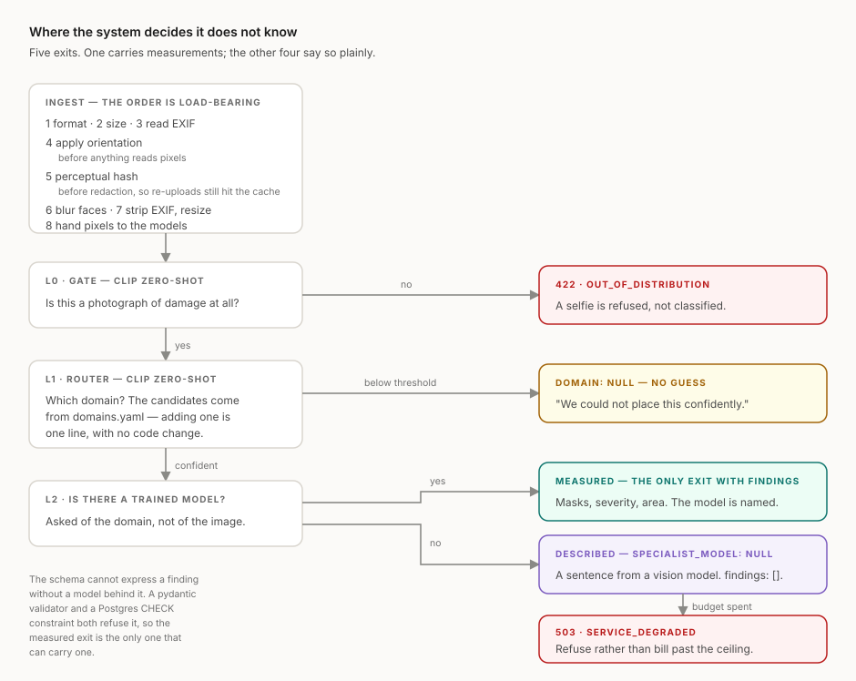

# BioVision

**A damage-analysis API that tells you what it does not know.**

BioVision takes a photograph of damage, decides which *domain* the photo belongs to
(vehicle, building, phone screen, …), runs a domain-specific expert model if
one exists — and, when one does not exist, says so explicitly instead of guessing.

> ## Status
>
> **The system runs end to end.** Upload a photograph and it is validated,
> decoded, oriented, hashed, redacted, resized, gated, routed, and either
> measured by a specialist or answered honestly — with real models on CPU.
>
> **Two things are built but not yet demonstrated, and this README does not
> pretend otherwise:**
>
> | | Why |
> |---|---|
> | The vehicle specialist | The training set (VehiDE, 13,945 images) is downloaded and measured; the checkpoint is not trained yet. Until it exists the vehicle domain reports `specialist_model: null` — the same honest answer every other domain gets. |
> | Every measurement table below | Empty until the evaluation scripts run against data that does not exist yet. |
>
> **An empty cell means the measurement has not been run.** It never means zero,
> and it is never filled by estimation — only by a script in `backend/scripts/`.
> That rule is the whole point of the project applied to its own documentation.

---

## What is proven, and what is not

The distinction this project is about, applied to itself.

| Claim | Evidence |
|---|---|
| Findings cannot exist without a model behind them | Enforced by a pydantic validator **and** a Postgres CHECK constraint; the response fails to construct. `tests/unit/test_schema_invariants.py` |
| Adding a domain needs no code change | A domain absent from `src/` becomes a real softmax column from YAML alone, tested against the **real** router. `tests/unit/test_domain_extensibility.py` |
| A weak routing guess never runs a specialist | `tests/contract/test_analyze_contract.py` |
| Anonymous traffic cannot spend the VLM budget | Call-counter assertion. `tests/contract/test_vlm_fallback.py` |
| The same image reaches the paid API once | Call-counter assertion, including a re-encoded copy |
| An exhausted budget degrades rather than fails | 503 on the fallback path, 200 on the specialist path |
| The stored image carries no EXIF | `tests/unit/test_ingest.py` |
| Redaction destroys detail rather than smoothing it | Every pixel in a mosaic block is identical |
| One user cannot read another's history *via this API* | `tests/contract/test_history_isolation.py` |
| **Postgres itself refuses a cross-user read** | 7 tests against a real database, no API in the path — `uv run python -m scripts.rls_check`. Finding this out took one command and found a real defect: see below. |
| The database refuses a finding with no model behind it | The same CHECK constraint, exercised by a direct write that bypasses the API |
| The container starts with no network and no egress | Built and run; 9 s cold start either way |
| A broken weights mount is reported, not hidden | `/health` returns 503 and Docker marks the container `unhealthy` |
| No server-side secret reaches the browser | Verified against the built bundle; CI fails if one appears |
| End-to-end p95 is far under the queue threshold | 266 ms measured — but on a **development machine**, not the VPS |

**Not proven yet**, and stated as such wherever it appears:

| Claim | What it needs |
|---|---|
| Router accuracy, calibration, ECE | An annotated evaluation set |
| Per-class vehicle mAP | A training run on VehiDE (data in hand) |
| Face-redaction miss rate | ~30–50 annotated photographs |
| VPS latency, real cost per request | A deployment |

---

## 1. Why this project exists

Most damage-assessment demos report a single accuracy number and stay silent about
where they break. That number is unusable for anyone who has to underwrite risk.

BioVision is built around the opposite claim:

* Every confidence score the API returns is either **calibrated** (and the response
  says `calibrated: true`) or **not calibrated** (and the response says
  `calibrated: false`). There is no third state.
* Domains without a trained expert model return `specialist_model: null`,
  an empty `findings` array, and an explicit `warning`. The system never fabricates
  structured findings from a general-purpose model.
* The evaluation section below reports **per-class** performance, not an average that
  hides the weak classes.

---

## 2. Architecture

Three layers, evaluated in order. Each layer can reject the request.



The diagram is drawn around the exits rather than the components, because the exits
are the argument. Four of the five are the system declining to answer, and each
declines for a different and stateable reason.

<details>
<summary>The same path as text</summary>

```
        upload
          │
          ▼
   ┌──────────────┐   not a damage/object photo
   │ L0  Gate     │ ────────────────────────────►  422 out_of_distribution
   │  CLIP 0-shot │
   └──────┬───────┘
          │ passes
          ▼
   ┌──────────────┐
   │ L1  Router   │  which domain? (candidate labels come from a config file)
   │  CLIP 0-shot │  raw softmax today; temperature scaling once a set exists
   └──────┬───────┘
          │
     ┌────┴─────────────────────────┐
     │ specialist exists?           │
     ▼ yes                          ▼ no
┌──────────────────┐      ┌─────────────────────────┐
│ L2  Specialist   │      │ Fallback: cloud VLM     │
│ VehiDE YOLO-seg  │      │  free-text description  │
│  → findings[]    │      │  → findings = []        │
│  calibrated:false│      │  calibrated:false       │
└──────────────────┘      │  warning: no_specialist │
                          └─────────────────────────┘
```

</details>

**The central architectural promise:** adding a new domain to the router is a
one-line change in `backend/src/biovision/domains/domains.yaml`. No code change,
no redeploy of model logic. A test enforces this.

### Layer summary

| Layer | Model | Runs on | Calibrated | Purpose |
|---|---|---|---|---|
| L0 Gate | CLIP zero-shot | CPU | — (a threshold, not a probability) | Reject selfies, screenshots, landscapes |
| L1 Router | CLIP zero-shot | CPU | **no** — awaiting an evaluation set | Assign a domain |
| L2 Specialist — vehicle | VehiDE fine-tuned YOLO-seg | CPU | **no** — severity is a rule, not a fitted model | 7-class damage segmentation |
| L2 Specialist — all other domains | *none* | — | no | Returns `null`, honestly |
| Fallback | Claude Haiku 4.5 | remote | no | Free-text description only, authenticated callers |

---

## 3. The honesty contract

This is the part of the project that matters most.

> The two examples below show the contract **once a specialist and a fitted
> temperature exist**. Today neither does, so a live response carries
> `specialist_model: null`, `calibrated: false` and
> `domain_confidence_calibrated: false` — the shape in the second example, for
> every domain including `vehicle`.

**Domain with a specialist:**

```json
{
  "request_id": "uuid",
  "domain": "vehicle",
  "domain_confidence": 0.93,
  "domain_confidence_calibrated": true,
  "specialist_model": "vehide-yolo-seg-v1",
  "calibrated": true,
  "findings": [
    {
      "type": "scratch",
      "score": 0.81,
      "bbox": [120, 340, 260, 410],
      "area_ratio": 0.04,
      "severity": "minor",
      "severity_calibrated": false
    }
  ],
  "integrity": {
    "exif_datetime": "2026-03-14T10:22:00Z",
    "exif_gps_present": true,
    "device": "Apple iPhone 14",
    "duplicate_of": null
  },
  "privacy": {
    "faces_blurred": 0,
    "plates_blurred": 0,
    "face_detector": "yunet-2023mar",
    "plate_detector": null
  },
  "timing_ms": { "gate": 60, "router": 95, "specialist": 380, "total": 610 }
}
```

**Domain without a specialist:**

```json
{
  "request_id": "uuid",
  "domain": "building",
  "domain_confidence": 0.71,
  "domain_confidence_calibrated": true,
  "specialist_model": null,
  "calibrated": false,
  "findings": [],
  "vlm_description": "A horizontal crack is visible on the wall ...",
  "warning": "no_specialist_model_for_domain"
}
```

`findings` is **never** populated from the VLM. A free-text description is a
description, not a measurement, and the schema keeps those two things apart.

### Two flags, because they are two facts

| Field | Question it answers |
|---|---|
| `calibrated` | Is this **result** a calibrated measurement? True only when a calibrated specialist produced the findings. |
| `domain_confidence_calibrated` | Has `domain_confidence` itself been temperature-scaled? |

They are separate because a calibrated router can route to a domain that has no
specialist at all. Collapsing them into one flag would force a choice between calling
a trustworthy confidence untrustworthy, or calling a description a measurement.

### Enforced, not merely intended

These rules are pydantic model validators, not conventions in a route handler. A
response with findings and no specialist behind them **fails to construct** — it
cannot reach a client. The invariants are covered by
`tests/unit/test_schema_invariants.py`:

* findings must be empty when `specialist_model` is null;
* `calibrated` must be false when `specialist_model` is null;
* a response without a specialist must carry a `warning` explaining why;
* `vlm_description` must be null when a specialist produced the result — if a
  specialist ran, the paid fallback was never called;
* a non-zero blur count requires a named detector.

---

## 4. API

| Method | Path | Purpose |
|---|---|---|
| `POST` | `/v1/analyze` | Analyze one image |
| `GET` | `/health` | Liveness + per-model load state |
| `GET` | `/v1/domains` | Supported domains and whether each has a specialist |
| `GET` | `/v1/requests` | The authenticated user's own request history |
| `DELETE` | `/v1/requests/{id}` | Delete one of the caller's analyses |
| `DELETE` | `/v1/requests` | Delete everything the caller has stored |

### Error codes

| Code | Meaning |
|---|---|
| `401` | Sign-in required, or the token is invalid |
| `404` | No such analysis for this caller |
| `413` | File exceeds the size limit (10 MB) |
| `415` | Unsupported format |
| `422` | Rejected by the gate — not a damage/object photograph |
| `429` | Rate limit exceeded |
| `503` | VLM budget exhausted — `service_degraded` |

A `503` means the fallback path is off. Requests for domains **with** a specialist
keep working; the system degrades, it does not fail.

Full generated schema: [`docs/openapi.json`](docs/openapi.json).

---

## 5. Image processing pipeline

Order is fixed and enforced in a single module (`pipeline/ingest.py`):

1. **Format check** — `jpg`, `png`, `webp`, `heic` (HEIC via `pillow-heif`; iPhone photos
   arrive as HEIC and rejecting them would exclude most real-world uploads).
2. **Size check** — max 10 MB.
3. **EXIF read** — capture time, GPS presence (boolean only), device — retained for the
   integrity block.
4. **EXIF-orientation rotation** — applied before any model sees the image.
5. **Perceptual hash (pHash)** — duplicate detection and VLM cache key.
6. **Face redaction** — applied before storage. Plates are not redacted; see 5.1.
7. **EXIF strip + resize** to 1280 px long edge — only this version is written to storage.
8. **Model inference.**

**The raw upload is never persisted.** Only the redacted, EXIF-stripped, resized
derivative reaches Supabase Storage — `PreparedImage` has nowhere to put the original
bytes, so this is structural rather than a habit.

Rejected inputs: animated GIF/WebP, images under 200 px, corrupt or truncated files.
Format is decided by magic bytes, never by the filename or Content-Type, and every
upload is decoded — a truncated file passes a header check and fails a decode.

Two orderings are load-bearing:

* **Orientation before everything.** Phones record rotation as metadata rather than
  rotating pixels. A model handed the raw buffer sees a sideways car, and the boxes
  it returns are in a coordinate frame the user never saw.
* **Hash before redaction.** The perceptual hash identifies the *submitted*
  photograph. Hashing afterwards would make the fingerprint depend on how many faces
  the detector happened to find, so the same image could hash differently on a second
  submission and slip past duplicate detection.

### 5.1 Redaction — what is actually redacted

| Class | Detector | Status |
|---|---|---|
| Faces | YuNet (`yunet-2023mar`, OpenCV Zoo) | Active when the checkpoint is present |
| Plates | *none* | **Not redacted in v1** |

**Plates are not blurred.** OpenCV 5 removed `CascadeClassifier`, which takes the
bundled Haar plate cascade off the table; pinning OpenCV back to 4.x to regain it
would buy a detector trained on Russian plates whose accuracy on Turkish plates has
never been measured. Under this project's own rule — a privacy guarantee needs a
number behind it — an unmeasured detector may not ship as one. Plate redaction is
deferred to Phase 5, where Ultralytics arrives for the vehicle specialist and brings
a YOLO plate detector into reach under a licence already in use here.

Until then every response carries `plate_detector: null`. The schema distinguishes
the two states that matter:

* `"face_detector": "yunet-2023mar", "faces_blurred": 0` — we looked, found none.
* `"plate_detector": null` — **we did not look.**

A non-zero blur count without a named detector fails schema validation, so a
redaction claim cannot be made without something behind it.

Redaction is a mosaic, not a Gaussian blur. A blur is a convolution and is at least
partly invertible; downsampling to blocks and scaling back up genuinely discards the
information.

#### Measured miss rate

| Class | Detector | Annotated boxes | Recall | Miss rate | False positives |
|---|---|---|---|---|---|
| face | `yunet-2023mar` | | | | |
| plate | *not redacted* | | n/a | n/a | n/a |

Produced by `backend/scripts/eval_redaction.py`. **Empty because it has not been
run** — the annotated set does not exist yet. Recall is the metric that matters: a
missed face is a privacy failure, while a false positive only mosaics some bodywork.

---

## 6. Calibration

A softmax output is not a probability. A "93% confidence" claim only means something
after calibration, so the router is calibrated on a held-out validation split using
**temperature scaling**.

| Metric | Before calibration | After calibration |
|---|---|---|
| ECE (Expected Calibration Error) | _TBD_ | _TBD_ |
| Router top-1 accuracy | _TBD_ | _TBD_ |
| Mean confidence vs. accuracy gap | _TBD_ | _TBD_ |

Reliability diagram: `docs/assets/reliability_router.png` *(not generated yet)*

Any output produced without a loaded temperature parameter returns
`calibrated: false`. The flag is derived from runtime state, not hard-coded.

---

## 7. Evaluation

### 7.1 Router — confusion matrix

Test set: ~50 images per domain, disjoint from the calibration split.

| true \ predicted | vehicle | building | phone_screen | other |
|---|---|---|---|---|
| vehicle | | | | |
| building | | | | |
| phone_screen | | | | |
| other | | | | |

Matrix image: `docs/assets/confusion_matrix_router.png` *(not generated yet)*

### 7.2 Gate — out-of-distribution rejection

| Metric | Value |
|---|---|
| True-positive rate (valid photos accepted) | _TBD_ |
| False-accept rate (selfies/screenshots accepted) | _TBD_ |
| Chosen threshold | _TBD_ |

### 7.3 Vehicle specialist — per-class performance (VehiDE test split)

Reported per class, deliberately. `scratch` is 40% of VehiDE's instances and the
other six share the rest, so a single average would be mostly a scratch score
wearing a general-purpose label.

| Class | Instances | mAP@50 | mAP@50-95 | Precision | Recall |
|---|---|---|---|---|---|
| scratch | 14,647 | | | | |
| dent | 5,681 | | | | |
| torn | 5,509 | | | | |
| missing_part | 2,818 | | | | |
| lamp_broken | 2,782 | | | | |
| punctured | 2,423 | | | | |
| glass_shatter | 2,221 | | | | |
| **all** | 36,081 | | | | |

**The metric columns are empty because no checkpoint has been trained yet.** The
instance counts are not — those are measured, by `scripts/inspect_vehide.py`, from
the dataset on disk.

Training is `notebooks/train_vehide_yolo.ipynb`, with the split and seed pinned and
the split fingerprinted, so anyone with their own copy of VehiDE reproduces these
numbers exactly. We train it ourselves rather than adopting a public checkpoint
because a checkpoint with an unknown train/test split makes this table
unverifiable — and this table is the headline claim.

> N. T. Huynh et al., "VehiDE Dataset: New dataset for Automatic vehicle damage
> detection in Car insurance," *IEEE KSE 2023*. doi:10.1109/KSE59128.2023.10299490

### 7.4 Latency (production VPS, 4 vCPU / 8 GB, CPU only)

| Stage | p50 (ms) | p95 (ms) |
|---|---|---|
| Preprocess | | |
| Gate | | |
| Router | | |
| Specialist | | |
| VLM fallback | | |
| **End-to-end** | | |

**Not yet measured on the production VPS**, which is why the table is empty.

For calibration of expectations only — development machine, 25 distinct 1600x1200
JPEGs, real CLIP on CPU with two torch threads, produced by
`backend/scripts/bench_latency.py`:

| Stage | p50 (ms) | p95 (ms) |
|---|---|---|
| Preprocess | 133 | 146 |
| Gate | 108 | 123 |
| Router | 0 | 0 |
| **End-to-end** | **242** | **266** |

Different hardware, synthetic images, no specialist loaded. These numbers do not go
in the table above and no claim rests on them.

The router costs ~0 ms because the gate and the router ask different questions of the
*same* CLIP embedding, and the encoder caches it for the duration of a request. Before
that fix each layer encoded the image separately and end-to-end was ~346 ms — the
measurement is what found it.

### 7.5 Severity thresholds — published, not measured

`severity` is a fixed-threshold heuristic over `area_ratio`. VehiDE carries no
severity ground truth, so there is nothing to calibrate against and no honest
accuracy to report for this field.

| Band | Condition | Calibrated |
|---|---|---|
| `minor` | `area_ratio < 0.02` | no |
| `moderate` | `0.02 <= area_ratio < 0.08` | no |
| `severe` | `area_ratio >= 0.08` | no |

Every finding carries `severity_calibrated: false`. The thresholds live in one place
(`models/severity.py`) and a unit test pins them to the numbers in this table, so the
code and the documentation cannot drift apart. **No accuracy claim in this README
covers `severity`.**

### 7.6 Golden set

20 hand-picked images with expected outputs are committed under
`backend/tests/golden/`. Any model swap or threshold change that alters these
outputs fails CI. This is the regression tripwire for the whole system.

### 7.7 Known failure modes

_To be filled from the evaluation runs — this section is expected to be non-empty._

---

## 8. Cost

| Item | Value |
|---|---|
| Cost per request — vehicle path (no VLM) | **$0.00** |
| Cost per request — fallback path (VLM) | **≈ $0.0028** (derived, not yet invoiced) |
| Monthly VLM budget ceiling | **$5.00** — a hard limit, not a guideline |
| Fallback requests the ceiling buys | ≈ 1,790 |
| Observed cost per request | _not yet measured_ |
| Cache hit rate | _not yet measured_ |

Derivation and the full reasoning: [`docs/COST.md`](docs/COST.md).

Four controls, in order of how much they save:

1. **The VLM is unreachable from the specialist path** — not a policy, there is no
   call site. Vehicle photographs, the primary use case, cost nothing per request.
2. **Anonymous callers never reach it.** The demo link is open at 20 requests per IP
   per day; the fallback requires sign-in. A published link cannot spend the budget.
3. **A perceptual-hash cache**, keyed by hash *and language* — without the language a
   cached Turkish description would be served to an English request. Matching is near
   rather than exact, within a measured threshold: after ingestion the same photograph
   at different JPEG qualities lands 0–2 bits apart while different photographs sit
   18–30 apart, so the threshold is 4.
4. **A hard monthly ceiling.** Warning at 80%; at 100% the VLM switches off and
   fallback requests return `503 service_degraded` while the specialist path keeps
   returning 200. The service degrades; it does not fail.

---

## 8.1 Data, authorisation, and retention

**Authorisation is row-level security in Postgres, not a filter in a handler.** Every
Supabase call is issued under the caller's own access token; no endpoint compares
`user_id` in code. A WHERE clause is something a refactor can drop, and the bug is
silent — the endpoint keeps working and starts returning other people's rows. An RLS
policy denies the query outright, so the API can have that bug and still not leak.

> **Demonstrated, and the demonstration found a defect.** Running the policies
> against a real database is one command:
>
> ```bash
> cd backend && uv run python -m scripts.rls_check
> ```
>
> It brings up a local Supabase stack, applies the migrations, creates two users
> and runs seven assertions with no API in the path. The first run failed on all
> seven: the migration created correct policies but granted no table privileges,
> and Postgres checks GRANT *before* it checks any policy — so every request,
> including a user reading their own rows, was refused and the policies never
> executed. It failed closed, so nothing leaked; the application simply could not
> work. A hosted project's default privileges would have hidden it.
>
> This is the argument for the whole approach in miniature. The design was right,
> the reasoning in the comments was right, and it did not work. Only running it
> said so.

| Claim | Status |
|---|---|
| One user cannot read another's analyses via the API | ✅ tested |
| A cross-user delete returns 404 and removes nothing | ✅ tested |
| Anonymous analyses are never persisted | ✅ tested |
| Storage receives the redacted JPEG, never the upload | ✅ tested |
| **Postgres refuses a cross-user read directly** | ✅ **verified against a real database** |
| **Postgres refuses a forged insert under another user's id** | ✅ verified |
| **An anonymous caller reaches no analyses at all** | ✅ verified — `anon` holds no grant |
| **`vlm_spend` is invisible to every user** | ✅ verified |
| **The database refuses findings with no specialist** | ✅ verified by direct write |
| The retention job actually runs | ⏳ needs a deployment and elapsed time |

**Retention: 7 days.** A `pg_cron` job deletes expired rows and their images nightly,
in the database rather than the API so it keeps running through a redeploy. Users can
also delete a single analysis or everything at once — a retention claim without a
deletion path is marketing.

**Anonymous analyses are never stored.** Nobody could retrieve or delete them, so
keeping the image would be collecting personal data with no owner and no deletion path.

The honesty contract is enforced in the database too: CHECK constraints refuse a row
carrying findings without a specialist, or a description alongside one. Even a direct
write that bypasses the API cannot record a finding no model produced.

---

## 9. Scope

**In v1:** three-layer pipeline · vehicle specialist · VLM fallback · router
calibration · OOD rejection · EXIF + pHash integrity checks · face/plate blurring ·
Google sign-in · rate limiting · Next.js frontend · Docker deployment · test suite.

**Deferred to v2:** queue/worker architecture · specialists for non-vehicle domains ·
repair-cost estimation · multi-image upload · mobile app · self-retraining.

### On the absence of a queue

This is a decision, not an omission. Synchronous request handling is the correct
choice while end-to-end p95 stays under ~3 s and concurrency stays low: a queue adds
a broker, a worker pool, job state, polling or websockets on the client, and a second
failure surface — in exchange for nothing at this load.

The migration trigger is stated in advance: **when end-to-end p95 exceeds 3 s, or
sustained concurrent requests exceed 2× the worker count, BioVision moves to a queue.**
Section 7.4 is what tells us whether we are there.

---

## 10. Setup

The backend runs against a **mock model backend** by default: deterministic
stand-ins that satisfy the same interfaces as the real models. Nothing is
downloaded, nothing reaches the network, and the app boots in well under a second.
That is what lets the whole test suite run in CI without 2 GB of checkpoints — a
test suite that needs a GPU stops being run.

```bash
cd backend && uv sync && uv run uvicorn biovision.main:app --reload
```

Then:

```bash
curl -s http://localhost:8000/health
```

```bash
curl -s -F image=@photo.jpg http://localhost:8000/v1/analyze
```

Interactive docs at `http://localhost:8000/docs`.

### Whole stack

```bash
docker compose up --build
```

### Checks

```bash
cd backend && uv run ruff check . && uv run mypy && uv run pytest
```

### Frontend

```bash
cd frontend && pnpm install && pnpm dev
```

Runs against `http://localhost:8000` by default. Without Supabase configured it
runs in demo mode: analysis works, sign-in and history are unavailable, and the
UI says so rather than failing at the first click.

### Model weights

Optional. Everything runs without them; features they back report themselves as
disabled rather than pretending.

```bash
cd backend && uv run python -m scripts.fetch_weights
```

Each artifact is verified against a pinned SHA-256, so a silently changed upstream
file is a loud failure rather than an unreproducible change in behaviour. Currently
this fetches the YuNet face detector (230 KB, MIT). Without it, `/health` reports
`redaction:face` as not ready and every response carries `face_detector: null`.

### Configuration

Copy `backend/.env.example` to `backend/.env`. Every setting is read through
`config.py` — nothing in the codebase touches `os.environ` directly. `.env` is
gitignored and CI fails if one is ever committed.

### Worker count

The backend runs with **at most 2 uvicorn workers**. Each worker loads its own copy of
CLIP and YOLO into RAM; on an 8 GB box, 4 workers exhaust memory and the machine dies.
This constraint is repeated as a comment at every place workers are configured.

---

## 11. Tech stack

| Concern | Choice |
|---|---|
| Backend | Python + FastAPI, Docker |
| Python packaging | `uv` |
| Frontend | Next.js (App Router) + TypeScript, `pnpm` |
| Frontend hosting | Vercel → `biovision.bilalgurkansanli.com` |
| Backend hosting | Self-managed VPS (4 vCPU / 8 GB / 100 GB) → `api.biovision.bilalgurkansanli.com` |
| Reverse proxy | Caddy (automatic HTTPS) |
| Gate + Router | CLIP / SigLIP zero-shot, CPU |
| Vehicle specialist | VehiDE fine-tuned YOLO segmentation (trained by this project) |
| Fallback | Claude Haiku 4.5 (`claude-haiku-4-5`) |
| Auth / DB / Storage | Supabase (Postgres + Google OAuth + Storage + RLS) |
| Request handling | Synchronous |
| Quality gates | `ruff`, `mypy`, `pytest` |

PyTorch is installed from the **CPU-only** wheel index. The server has no GPU, and
CUDA libraries would add gigabytes to the image for no benefit.

---

## 12. License

**AGPL-3.0.** Ultralytics YOLO is AGPL-3.0, and BioVision links against it, so the
whole work is distributed under the same terms. If you deploy a modified version as a
network service, you must offer the modified source to its users.

See [`LICENSE`](LICENSE) for the license text and [`NOTICE.md`](NOTICE.md) for asset
licensing — golden-set photographs, evaluation-image manifests, model weights, and
the VehiDE dataset, which is **not** redistributed by this repository.

---

## 13. Documentation

| Document | What it covers |
|---|---|
| [`docs/PLAN.md`](docs/PLAN.md) | Phases, acceptance criteria, what is done |
| [`docs/DECISIONS.md`](docs/DECISIONS.md) | 24 decisions with their reasoning and revisit triggers |
| [`docs/COST.md`](docs/COST.md) | Per-request cost, derived; the four spend controls |
| [`docs/DEPLOY.md`](docs/DEPLOY.md) | Deployment runbook and its verification checklist |
| [`docs/DEMO.md`](docs/DEMO.md) | 90-second demo script |
| [`docs/OPEN_QUESTIONS.md`](docs/OPEN_QUESTIONS.md) | What is still blocked, and on whom |
| [`docs/openapi.json`](docs/openapi.json) | Generated schema; CI fails if it drifts |
| [`NOTICE.md`](NOTICE.md) | Asset licensing |

Several decisions in the log were found by measuring rather than by design — the
gate and router encoding the same image twice, exact hash matching missing
re-encoded copies, `CascadeClassifier` disappearing in OpenCV 5. Each is recorded
with the measurement that prompted it.

---

## 14. Author

Bilal Gürkan Şanlı — [bilalgurkansanli.com](https://bilalgurkansanli.com)
